# Day 1
Andy Teucher  
November 20, 2014  


```r
library(dplyr)
```

```
## 
## Attaching package: 'dplyr'
## 
## The following object is masked from 'package:stats':
## 
##     filter
## 
## The following objects are masked from 'package:base':
## 
##     intersect, setdiff, setequal, union
```

```r
library(ggplot2)
library(scales)
library(jaggernaut)
```

```
## Loading required package: foreach
## Loading required package: doParallel
## Loading required package: iterators
## Loading required package: parallel
```

```r
options(digits = 4)
```

## Exercise 1

Prior information told us it is *definitely* biased towards tails:


```r
model1 <- jags_model("
  model {
    theta ~ dunif(0,0.5)
    y ~ dbin(theta, n)
  }")
```

By specifying the prior distribution as bounded by (0, 0.5), it means that the final estimate of theta has to be less than 0.5, i.e., the probability of throwing a head is less than 0.5.


```r
data <- data.frame(n = 10, y = 3) # 10 trials, 3 tails
analysis1 <- jags_analysis(model1, data = data)
```

```
## Analysis converged (rhat:1.01)
```

```r
plot(analysis1)
```

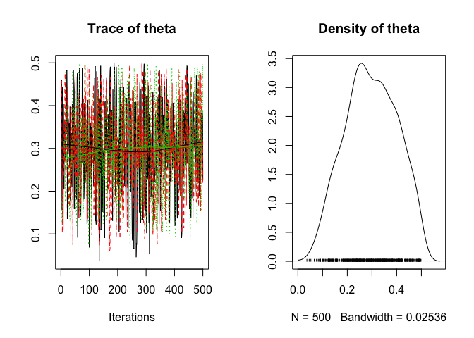 

```r
coef(analysis1)
```

```
##       estimate  lower  upper     sd error significance
## theta   0.3063 0.1041 0.4824 0.1018    62            0
```

## Black Cherry Trees


```r
data(trees)
ggplot(trees, aes(x = Girth, y = Volume)) + geom_point()
```

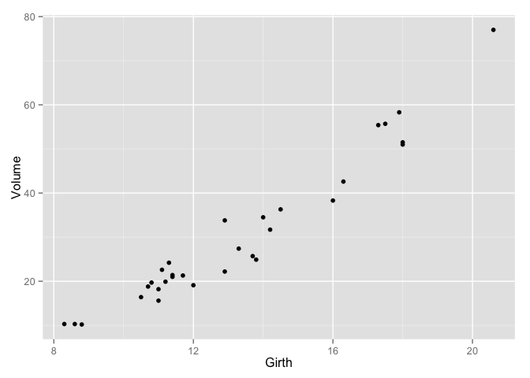 


#### To set up parallel processing (one for each chain), run the following code:


```r
if (getDoParWorkers() == 1) {
  registerDoParallel(4)
  opts_jagr(parallel = TRUE)
}
```


```r
tree_model <- jags_model("
model {
  alpha ~ dnorm(0, 50^-2)
  beta ~ dnorm(0, 50^-2)
  sigma ~ dunif(0, 10)
  
  for (i in 1:length(Volume)) {
    eMu[i] <- alpha + beta * Girth[i]
    Volume[i] ~ dnorm(eMu[i], sigma^-2)
  }
}")

trees_analysis <- jags_analysis(tree_model, data = trees)
```

```
## Analysis converged (rhat:1.03)
```

```r
plot(trees_analysis)
```

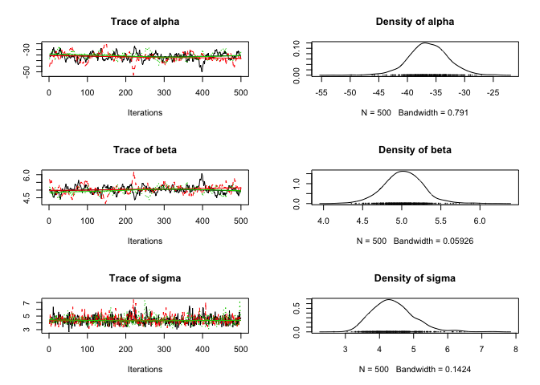 

```r
coef(trees_analysis)
```

```
##       estimate   lower   upper     sd error significance
## alpha  -37.730 -43.790 -30.345 3.5002    18            0
## beta     5.124   4.595   5.583 0.2560    10            0
## sigma    4.440   3.467   5.797 0.5897    26            0
```

## Exercise 2:


```r
auto_corr(trees_analysis)
```

```
##          alpha    beta     sigma
## Lag 1  0.93805 0.93877  0.273047
## Lag 5  0.71576 0.72352  0.043968
## Lag 10 0.53311 0.52968  0.030729
## Lag 50 0.02111 0.01432 -0.005328
```

```r
cross_corr(trees_analysis)
```

```
##          alpha     beta    sigma
## alpha  1.00000 -0.97403 -0.06477
## beta  -0.97403  1.00000  0.06875
## sigma -0.06477  0.06875  1.00000
```

The plots show "poor chain mixing"

Looking at at the plots and the outputs of auto_corr and cross_corr, ther is high autocorrelation in alpha and beta, and high cross-correlation betweenalpha and beta. The cross-correlation is intuitive because as you move the intercept up or down, the slope responds in the opposite direction. The autocorrelation is caused by the cross-correlation because in each MCMC step, the estimate of one parameter is updated based on the previous estimate of the other parameter, and back and forth...

## Exercise 3:

When `jaggernaut` tests for convergence, it evaluates it using `rhat` of the worst performing parameter.


```r
# ?convergence
convergence(trees_analysis, combine = FALSE)
```

```
##       convergence
## alpha        1.03
## beta         1.02
## sigma        1.01
```

```r
# Can get just specific parameters:
convergence(trees_analysis, parm = c("alpha", "beta"), combine = FALSE)
```

```
##       convergence
## alpha        1.03
## beta         1.02
```

Run `opts_jagr()` to see the jaggernaut options. Set with `opts_jagr(option = value)` (e.g., `opts_jagr(mode = "paper")` or `opts_jagr(nsamples = 5000)`).


## Exercise 4:
To run more iterations (e.g., to get better convergence):

N.B. Thinning 10,000 iterations down to 500 gets rid of the autocorrelation.


```r
trees_analysis <- jags_analysis(tree_model, data = trees, niter = 10^4)
```

```
## Analysis converged (rhat:1)
```

```r
plot(trees_analysis)
```

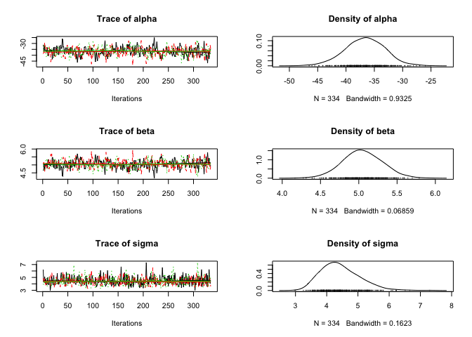 

```r
coef(trees_analysis)
```

```
##       estimate   lower   upper     sd error significance
## alpha  -36.892 -43.889 -29.843 3.5800    19            0
## beta     5.062   4.530   5.567 0.2635    10            0
## sigma    4.464   3.442   5.942 0.6313    28            0
```

```r
convergence(trees_analysis, combine = FALSE)
```

```
##       convergence
## alpha           1
## beta            1
## sigma           1
```

If you center the intercept on the x variable (girth), it will break the cross-correlation between the slope and intercept because you can now change the slope without affecting the intercept, and vice-versa.

## Exercise 5:


```r
## Option 1 Transform the variable:
tree_model <- jags_model("
model {
  alpha ~ dnorm(0, 50^-2)
  beta ~ dnorm(0, 50^-2)
  sigma ~ dunif(0, 10)
  
  for (i in 1:length(Volume)) {
    eMu[i] <- alpha + beta * Girth[i]
    Volume[i] ~ dnorm(eMu[i], sigma^-2)
  }
}")

trees$Girth <- trees$Girth - mean(trees$Girth)

trees_analysis <- jags_analysis(tree_model, data = trees)
```

```
## Analysis converged (rhat:1.02)
```

```r
plot(trees_analysis)
```

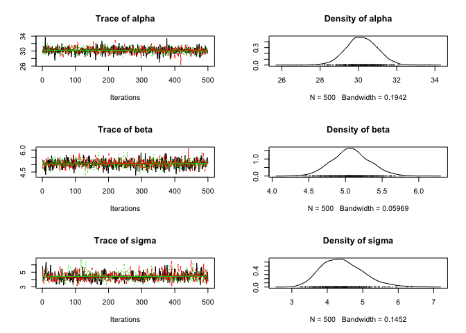 

```r
coef(trees_analysis)
```

```
##       estimate  lower  upper     sd error significance
## alpha   30.152 28.552 31.631 0.7816     5            0
## beta     5.070  4.578  5.576 0.2546    10            0
## sigma    4.458  3.426  6.009 0.6414    29            0
```

```r
auto_corr(trees_analysis)
```

```
##            alpha     beta     sigma
## Lag 1  -0.002762 -0.07164  0.383701
## Lag 5  -0.006117  0.01866  0.015936
## Lag 10 -0.058382 -0.01291  0.045720
## Lag 50 -0.004133 -0.02850 -0.004687
```

```r
cross_corr(trees_analysis)
```

```
##          alpha     beta    sigma
## alpha  1.00000 -0.01042  0.01529
## beta  -0.01042  1.00000 -0.02152
## sigma  0.01529 -0.02152  1.00000
```

```r
data(trees) # Reset trees after changing the Girth column

## Option 2 (in the BUGS code):
tree_model <- jags_model("
model {
  alpha ~ dnorm(0, 50^-2)
  beta ~ dnorm(0, 50^-2)
  sigma ~ dunif(0, 10)
  
  for (i in 1:length(Volume)) {
    eMu[i] <- alpha + beta * (Girth[i] - mean(Girth))
    Volume[i] ~ dnorm(eMu[i], sigma^-2)
  }
}")

trees_analysis <- jags_analysis(tree_model, data = trees)
```

```
## Analysis converged (rhat:1)
```

```r
plot(trees_analysis)
```

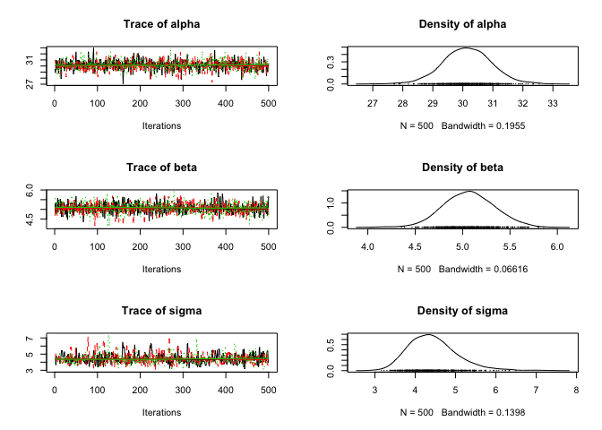 

```r
coef(trees_analysis)
```

```
##       estimate  lower  upper     sd error significance
## alpha   30.153 28.693 31.731 0.7820     5            0
## beta     5.065  4.547  5.581 0.2567    10            0
## sigma    4.420  3.412  5.814 0.6144    27            0
```

```r
auto_corr(trees_analysis)
```

```
##             alpha      beta    sigma
## Lag 1   0.0008889 -0.044572  0.30127
## Lag 5   0.0327593  0.001336  0.01419
## Lag 10  0.0227428 -0.021476 -0.02441
## Lag 50 -0.0102427 -0.019008 -0.01826
```

```r
cross_corr(trees_analysis)
```

```
##           alpha     beta     sigma
## alpha  1.000000 0.080010 -0.008529
## beta   0.080010 1.000000  0.001002
## sigma -0.008529 0.001002  1.000000
```

```r
## Option 3:
tree_model <- jags_model("
model {
  alpha ~ dnorm(0, 50^-2)
  beta ~ dnorm(0, 50^-2)
  sigma ~ dunif(0, 10)
  
  for (i in 1:length(Volume)) {
    eMu[i] <- alpha + beta * Girth[i]
    Volume[i] ~ dnorm(eMu[i], sigma^-2)
  }
}")

select_data(tree_model) <- c("Volume", "Girth+") # The `+` centers the Girth parameter
trees_analysis <- jags_analysis(tree_model, data = trees)
```

```
## Analysis converged (rhat:1.01)
```

```r
plot(trees_analysis)
```

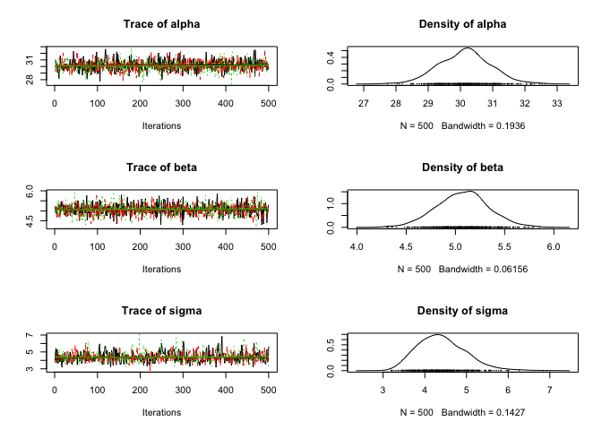 

```r
coef(trees_analysis)
```

```
##       estimate  lower  upper     sd error significance
## alpha   30.138 28.548 31.783 0.8066     5            0
## beta     5.064  4.554  5.588 0.2616    10            0
## sigma    4.440  3.374  5.856 0.6460    28            0
```

```r
auto_corr(trees_analysis)
```

```
##            alpha      beta    sigma
## Lag 1   0.050444 -0.007754  0.30613
## Lag 5   0.027901 -0.022202 -0.02034
## Lag 10  0.001214  0.027737  0.03592
## Lag 50 -0.030463  0.008991 -0.04902
```

```r
cross_corr(trees_analysis)
```

```
##          alpha     beta   sigma
## alpha  1.00000 -0.01035 0.03188
## beta  -0.01035  1.00000 0.01753
## sigma  0.03188  0.01753 1.00000
```

## Exercise 6:


```r
derived_code <- "data {
  for(i in 1:length(Volume)) { 
    prediction[i] <- alpha + beta * Girth[i]

    simulated[i] ~ dnorm(prediction[i], sigma^-2)

    D_observed[i] <- log(dnorm(Volume[i], prediction[i], sigma^-2))
    D_simulated[i] <- log(dnorm(simulated[i], prediction[i], sigma^-2))
  }
  residual <- (Volume - prediction) / sigma
  discrepancy <- sum(D_observed) - sum(D_simulated)
}"

predicted <- predict(trees_analysis, newdata = "Girth", derived_code = derived_code)

new.data <- data.frame(Girth = 8)

predicted2 <- predict(trees_analysis, newdata = new.data, derived_code = derived_code)
predicted2
```

```
##   Girth Height Volume estimate  lower upper    sd error significance
## 1     8     76  30.17    3.558 0.4506 6.777 1.599    89        0.028
```

The 95% prediction interval is 0.4506 to 6.7773

## Exercise 9:

To fit the allometric relationship, log the parameters in the `select_data()` call


```r
data(trees)

tree_model <- jags_model("
model {
  alpha ~ dnorm(0, 50^-2)
  beta ~ dnorm(0, 50^-2)
  sigma ~ dunif(0, 10)
  
  for (i in 1:length(Volume)) {
    eMu[i] <- alpha + beta * Girth[i]
    Volume[i] ~ dnorm(eMu[i], sigma^-2)
  }
}")

select_data(tree_model) <- c("log(Volume)", "log(Girth)+")
trees_analysis <- jags_analysis(tree_model, data = trees)
```

```
## Analysis converged (rhat:1.01)
```

```r
plot(trees_analysis)
```

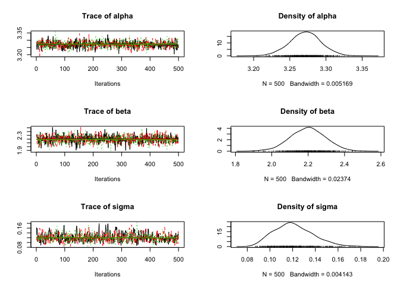 

```r
coef(trees_analysis)
```

```
##       estimate   lower  upper      sd error significance
## alpha   3.2734 3.22915 3.3146 0.02156     1            0
## beta    2.1989 2.00622 2.3839 0.09653     9            0
## sigma   0.1203 0.09359 0.1573 0.01641    26            0
```

```r
derived_code <- "data {
  for(i in 1:length(Volume)) { 
    prediction[i] <- alpha + beta * Girth[i]

    simulated[i] ~ dnorm(prediction[i], sigma^-2)

    D_observed[i] <- log(dnorm(Volume[i], prediction[i], sigma^-2))
    D_simulated[i] <- log(dnorm(simulated[i], prediction[i], sigma^-2))
  }
  residual <- (Volume - prediction) / sigma
  discrepancy <- sum(D_observed) - sum(D_simulated)
}"

predicted <- predict(trees_analysis, newdata = "Girth", derived_code = derived_code)
simulated <- predict(trees_analysis, parm = "simulated", newdata = "Girth", 
                     derived_code = derived_code)

## Need to exponentiate the predicted values to get them back into regular parameter space:

gp <- ggplot(predicted, aes(x = Girth, y = exp(estimate))) + 
  geom_point(data = dataset(trees_analysis), aes(y = Volume)) + 
  geom_line() + 
  geom_line(aes(y = exp(lower)), linetype = "dashed") + 
  geom_line(aes(y = exp(upper)), linetype = "dashed") + 
  geom_line(data = simulated, aes(y = lower), linetype = "dotted") + 
  geom_line(data = simulated, aes(y = upper), linetype = "dotted") + 
  scale_y_continuous(name = "Volume")

gp
```

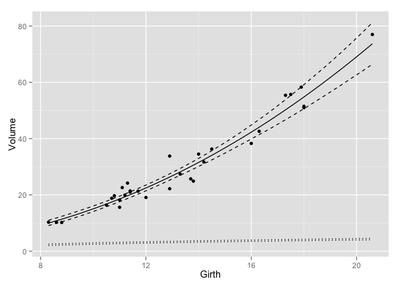 

You can also specify `log(predicted)` to generate back-transformed predicted values and use `dlnorm` to generate the simulated data in the derived code, :


```r
data(trees)

tree_model <- jags_model("
model {
  alpha ~ dnorm(0, 50^-2)
  beta ~ dnorm(0, 50^-2)
  sigma ~ dunif(0, 10)
  
  for (i in 1:length(Volume)) {
    eMu[i] <- alpha + beta * Girth[i]
    Volume[i] ~ dnorm(eMu[i], sigma^-2)
  }
}")

select_data(tree_model) <- c("log(Volume)", "log(Girth)+")
trees_analysis <- jags_analysis(tree_model, data = trees)
```

```
## Analysis converged (rhat:1.03)
```

```r
plot(trees_analysis)
```

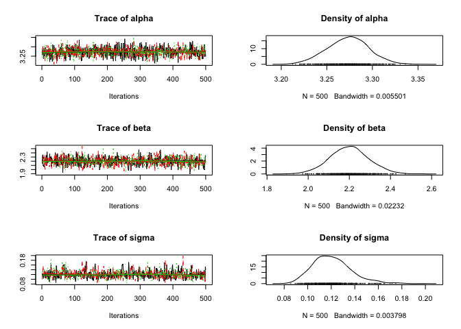 

```r
coef(trees_analysis)
```

```
##       estimate   lower  upper      sd error significance
## alpha   3.2734 3.23073 3.3177 0.02192     1            0
## beta    2.2013 2.01600 2.3757 0.09513     8            0
## sigma   0.1208 0.09403 0.1626 0.01726    28            0
```

```r
derived_code <- "data {
  for(i in 1:length(Volume)) { 
    log(prediction[i]) <- alpha + beta * Girth[i]

    simulated[i] ~ dlnorm(log(prediction[i]), sigma^-2)

    D_observed[i] <- log(dnorm(Volume[i], prediction[i], sigma^-2))
    D_simulated[i] <- log(dnorm(simulated[i], prediction[i], sigma^-2))
  }
  residual <- (Volume - prediction) / sigma
  discrepancy <- sum(D_observed) - sum(D_simulated)
}"

predicted <- predict(trees_analysis, newdata = "Girth", derived_code = derived_code)
simulated <- predict(trees_analysis, parm = "simulated", newdata = "Girth", 
                     derived_code = derived_code)

## Need to exponentiate the predicted values to get them back into regular parameter space:

gp <- ggplot(predicted, aes(x = Girth, y = estimate)) + 
  geom_point(data = dataset(trees_analysis), aes(y = Volume)) + 
  geom_line() + 
  geom_line(aes(y = lower), linetype = "dashed") + 
  geom_line(aes(y = upper), linetype = "dashed") + 
  geom_line(data = simulated, aes(y = lower), linetype = "dotted") + 
  geom_line(data = simulated, aes(y = upper), linetype = "dotted") + 
  scale_y_continuous(name = "Volume")

gp
```

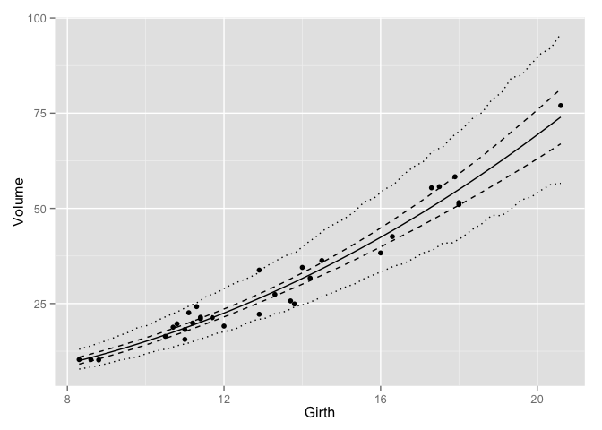 

## Exercise 10:


```r
data(trees)

tree_model <- jags_model("
model {
  alpha ~ dnorm(0, 50^-2)
  beta ~ dnorm(0, 50^-2)
  betaHeight ~ dnorm(0, 50^-2)
  sigma ~ dunif(0, 10)
  
  for (i in 1:length(Volume)) {
    eMu[i] <- alpha + beta * Girth[i] + betaHeight * Height[i]
    Volume[i] ~ dnorm(eMu[i], sigma^-2)
  }
}")

select_data(tree_model) <- c("log(Volume)", "log(Girth)+", "log(Height)+")
trees_analysis <- jags_analysis(tree_model, data = trees)
```

```
## Analysis converged (rhat:1)
```

```r
plot(trees_analysis)
```

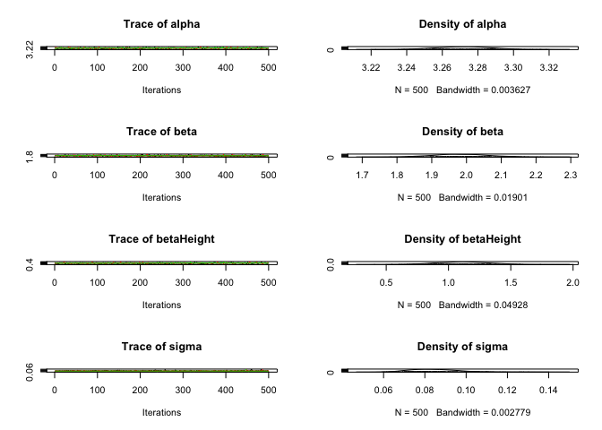 

```r
coef(trees_analysis)
```

```
##            estimate   lower  upper      sd error significance
## alpha       3.27263 3.24345 3.3014 0.01495     1            0
## beta        1.98276 1.82396 2.1452 0.07851     8            0
## betaHeight  1.10994 0.70507 1.5275 0.21025    37            0
## sigma       0.08458 0.06484 0.1119 0.01181    28            0
```

```r
derived_code <- "data {
  for(i in 1:length(Volume)) { 
    log(prediction[i]) <- alpha + beta * Girth[i] + betaHeight * Height[i]

    simulated[i] ~ dlnorm(log(prediction[i]), sigma^-2)

    D_observed[i] <- log(dnorm(Volume[i], prediction[i], sigma^-2))
    D_simulated[i] <- log(dnorm(simulated[i], prediction[i], sigma^-2))
  }
  residual <- (Volume - prediction) / sigma
  discrepancy <- sum(D_observed) - sum(D_simulated)
}"

predicted <- predict(trees_analysis, newdata = c("Girth", "Height"), 
                     derived_code = derived_code, length_out = 10)

simulated <- predict(trees_analysis, parm = "simulated", newdata = "Girth", 
                     derived_code = derived_code, length_out = 10)

gp <- ggplot(predicted, aes(x = Girth, y = estimate)) + 
  facet_wrap(~ Height) + 
  geom_point(data = dataset(trees_analysis), aes(y = Volume)) + 
  geom_line() + 
  geom_line(aes(y = lower), linetype = "dashed") + 
  geom_line(aes(y = upper), linetype = "dashed") + 
  geom_line(data = simulated, aes(y = lower), linetype = "dotted") + 
  geom_line(data = simulated, aes(y = upper), linetype = "dotted") + 
  scale_y_continuous(name = "Volume")

gp
```

 

As the parameter estimate for Height is different from zero, it is a likely addition to the model.

