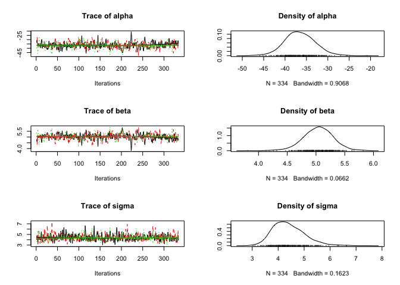
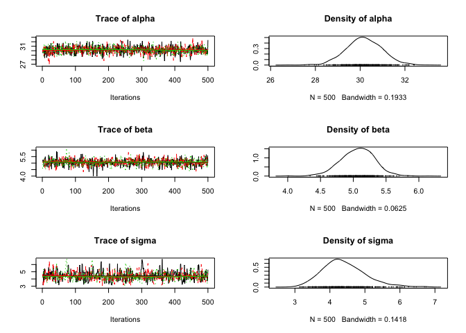
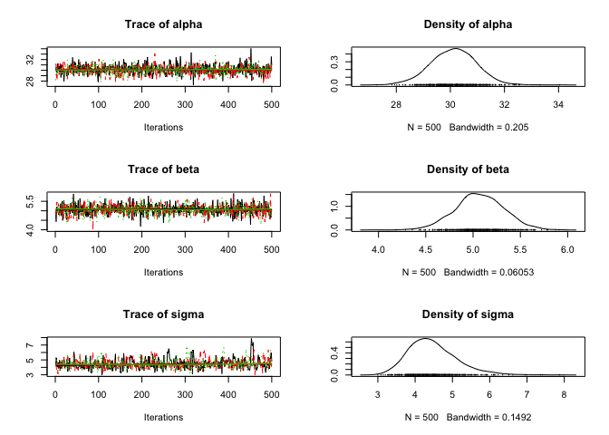
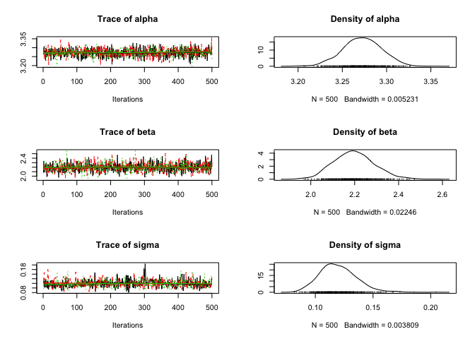
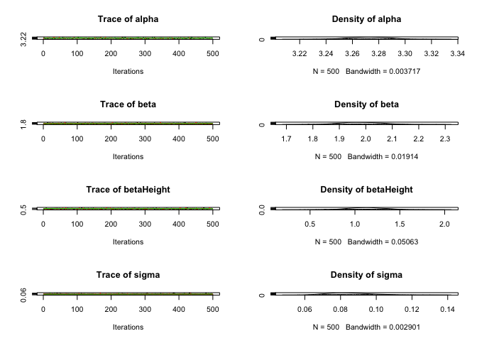

    library(dplyr)
    library(ggplot2)
    library(scales)
    library(jaggernaut)
    options(digits = 4)

Exercise 1
----------

Prior information told us it is *definitely* biased towards tails:

    model1 <- jags_model("
      model {
        theta ~ dunif(0,0.5)
        y ~ dbin(theta, n)
      }")

By specifying the prior distribution as bounded by (0, 0.5), it means
that the final estimate of theta has to be less than 0.5, i.e., the
probability of throwing a head is less than 0.5.

    data <- data.frame(n = 10, y = 3) # 10 trials, 3 tails
    analysis1 <- jags_analysis(model1, data = data)

    ## Analysis converged (rhat:1)

    plot(analysis1)

    coef(analysis1)

    ##       estimate  lower  upper     sd error significance
    ## theta   0.3084 0.1161 0.4868 0.1021    60            0

Black Cherry Trees
------------------

    data(trees)
    ggplot(trees, aes(x = Girth, y = Volume)) + geom_point()

#### To set up parallel processing (one for each chain), run the following code:

    if (getDoParWorkers() == 1) {
      registerDoParallel(4)
      opts_jagr(parallel = TRUE)
    }

    tree_model <- jags_model("
    model {
      alpha ~ dnorm(0, 50^-2)
      beta ~ dnorm(0, 50^-2)
      sigma ~ dunif(0, 10)
      
      for (i in 1:length(Volume)) {
        eMu[i] <- alpha + beta * Girth[i]
        Volume[i] ~ dnorm(eMu[i], sigma^-2)
      }
    }")

    trees_analysis <- jags_analysis(tree_model, data = trees)

    ## Analysis converged (rhat:1.05)

    plot(trees_analysis)

    coef(trees_analysis)

    ##       estimate   lower   upper     sd error significance
    ## alpha  -37.208 -44.144 -30.873 3.3922    18            0
    ## beta     5.084   4.627   5.603 0.2490    10            0
    ## sigma    4.419   3.378   5.808 0.6283    27            0

Exercise 2:
-----------

    auto_corr(trees_analysis)

    ##          alpha    beta     sigma
    ## Lag 1   0.9294  0.9264  0.325946
    ## Lag 5   0.7121  0.7158 -0.018194
    ## Lag 10  0.5368  0.5373  0.008175
    ## Lag 50 -0.1305 -0.1310 -0.035093

    cross_corr(trees_analysis)

    ##          alpha     beta    sigma
    ## alpha  1.00000 -0.97257 -0.07121
    ## beta  -0.97257  1.00000  0.07327
    ## sigma -0.07121  0.07327  1.00000

The plots show "poor chain mixing"

Looking at at the plots and the outputs of auto\_corr and cross\_corr,
ther is high autocorrelation in alpha and beta, and high
cross-correlation betweenalpha and beta. The cross-correlation is
intuitive because as you move the intercept up or down, the slope
responds in the opposite direction. The autocorrelation is caused by the
cross-correlation because in each MCMC step, the estimate of one
parameter is updated based on the previous estimate of the other
parameter, and back and forth...

Exercise 3:
-----------

When `jaggernaut` tests for convergence, it evaluates it using `rhat` of
the worst performing parameter.

    # ?convergence
    convergence(trees_analysis, combine = FALSE)

    ##       convergence
    ## alpha        1.05
    ## beta         1.05
    ## sigma        1.01

    # Can get just specific parameters:
    convergence(trees_analysis, parm = c("alpha", "beta"), combine = FALSE)

    ##       convergence
    ## alpha        1.05
    ## beta         1.05

Run `opts_jagr()` to see the jaggernaut options. Set with
`opts_jagr(option = value)` (e.g., `opts_jagr(mode = "paper")` or
`opts_jagr(nsamples = 5000)`).

Exercise 4:
-----------

To run more iterations (e.g., to get better convergence):

N.B. Thinning 10,000 iterations down to 500 gets rid of the
autocorrelation.

    trees_analysis <- jags_analysis(tree_model, data = trees, niter = 10^4)

    ## Analysis converged (rhat:1)

    plot(trees_analysis)

    coef(trees_analysis)

    ##       estimate   lower   upper     sd error significance
    ## alpha  -36.531 -43.309 -29.148 3.5412    19            0
    ## beta     5.037   4.524   5.526 0.2606    10            0
    ## sigma    4.409   3.416   5.763 0.6118    27            0

    convergence(trees_analysis, combine = FALSE)

    ##       convergence
    ## alpha           1
    ## beta            1
    ## sigma           1

If you center the intercept on the x variable (girth), it will break the
cross-correlation between the slope and intercept because you can now
change the slope without affecting the intercept, and vice-versa.

Exercise 5:
-----------

    ## Option 1 Transform the variable:
    tree_model <- jags_model("
    model {
      alpha ~ dnorm(0, 50^-2)
      beta ~ dnorm(0, 50^-2)
      sigma ~ dunif(0, 10)
      
      for (i in 1:length(Volume)) {
        eMu[i] <- alpha + beta * Girth[i]
        Volume[i] ~ dnorm(eMu[i], sigma^-2)
      }
    }")

    trees$Girth <- trees$Girth - mean(trees$Girth)

    trees_analysis <- jags_analysis(tree_model, data = trees)

    ## Analysis converged (rhat:1.01)

    plot(trees_analysis)

    coef(trees_analysis)

    ##       estimate  lower  upper     sd error significance
    ## alpha   30.164 28.589 31.800 0.8150     5            0
    ## beta     5.062  4.556  5.569 0.2627    10            0
    ## sigma    4.453  3.436  5.827 0.5928    27            0

    auto_corr(trees_analysis)

    ##            alpha     beta    sigma
    ## Lag 1  -0.016674 -0.01895  0.30947
    ## Lag 5   0.008931 -0.01515  0.01790
    ## Lag 10  0.017817 -0.03106 -0.04777
    ## Lag 50 -0.002996 -0.03276 -0.03056

    cross_corr(trees_analysis)

    ##          alpha      beta    sigma
    ## alpha 1.000000  0.007366  0.01949
    ## beta  0.007366  1.000000 -0.03900
    ## sigma 0.019493 -0.038998  1.00000

    data(trees) # Reset trees after changing the Girth column

    ## Option 2 (in the BUGS code):
    tree_model <- jags_model("
    model {
      alpha ~ dnorm(0, 50^-2)
      beta ~ dnorm(0, 50^-2)
      sigma ~ dunif(0, 10)
      
      for (i in 1:length(Volume)) {
        eMu[i] <- alpha + beta * (Girth[i] - mean(Girth))
        Volume[i] ~ dnorm(eMu[i], sigma^-2)
      }
    }")

    trees_analysis <- jags_analysis(tree_model, data = trees)

    ## Analysis converged (rhat:1.01)

    plot(trees_analysis)

    coef(trees_analysis)

    ##       estimate  lower  upper     sd error significance
    ## alpha   30.174 28.629 31.708 0.7908     5            0
    ## beta     5.066  4.552  5.557 0.2545    10            0
    ## sigma    4.406  3.385  5.859 0.6108    28            0

    auto_corr(trees_analysis)

    ##           alpha      beta      sigma
    ## Lag 1  -0.01459  0.024472  0.3418418
    ## Lag 5  -0.03020  0.002779 -0.0206434
    ## Lag 10 -0.02536  0.023200  0.0085664
    ## Lag 50  0.00673 -0.004995 -0.0006585

    cross_corr(trees_analysis)

    ##           alpha     beta     sigma
    ## alpha  1.000000  0.06024 -0.004343
    ## beta   0.060236  1.00000 -0.032313
    ## sigma -0.004343 -0.03231  1.000000

    ## Option 3:
    tree_model <- jags_model("
    model {
      alpha ~ dnorm(0, 50^-2)
      beta ~ dnorm(0, 50^-2)
      sigma ~ dunif(0, 10)
      
      for (i in 1:length(Volume)) {
        eMu[i] <- alpha + beta * Girth[i]
        Volume[i] ~ dnorm(eMu[i], sigma^-2)
      }
    }")

    select_data(tree_model) <- c("Volume", "Girth+") # The `+` centers the Girth parameter
    trees_analysis <- jags_analysis(tree_model, data = trees)

    ## Analysis converged (rhat:1)

    plot(trees_analysis)

    coef(trees_analysis)

    ##       estimate  lower  upper     sd error significance
    ## alpha   30.115 28.457 31.682 0.8350     5            0
    ## beta     5.068  4.551  5.576 0.2579    10            0
    ## sigma    4.470  3.411  5.964 0.6478    29            0

    auto_corr(trees_analysis)

    ##            alpha     beta      sigma
    ## Lag 1   0.010157 -0.07775  0.4121949
    ## Lag 5  -0.008484 -0.03941  0.0012494
    ## Lag 10  0.013496  0.01731 -0.0069800
    ## Lag 50  0.035899  0.04411 -0.0002692

    cross_corr(trees_analysis)

    ##          alpha      beta     sigma
    ## alpha  1.00000 -0.013640 -0.041444
    ## beta  -0.01364  1.000000  0.002709
    ## sigma -0.04144  0.002709  1.000000

Exercise 6:
-----------

    derived_code <- "data {
      for(i in 1:length(Volume)) { 
        prediction[i] <- alpha + beta * Girth[i]

        simulated[i] ~ dnorm(prediction[i], sigma^-2)

        D_observed[i] <- log(dnorm(Volume[i], prediction[i], sigma^-2))
        D_simulated[i] <- log(dnorm(simulated[i], prediction[i], sigma^-2))
      }
      residual <- (Volume - prediction) / sigma
      discrepancy <- sum(D_observed) - sum(D_simulated)
    }"

    predicted <- predict(trees_analysis, newdata = "Girth", derived_code = derived_code)

    new.data <- data.frame(Girth = 8)

    predicted2 <- predict(trees_analysis, newdata = new.data, derived_code = derived_code)
    predicted2

    ##   Girth Height Volume estimate  lower upper  sd error significance
    ## 1     8     76  30.17    3.518 0.2297 6.564 1.6    90       0.0387

The 95% prediction interval is 0.2297 to 6.5641

Exercise 9:
-----------

To fit the allometric relationship, log the parameters in the
`select_data()` call

    data(trees)

    tree_model <- jags_model("
    model {
      alpha ~ dnorm(0, 50^-2)
      beta ~ dnorm(0, 50^-2)
      sigma ~ dunif(0, 10)
      
      for (i in 1:length(Volume)) {
        eMu[i] <- alpha + beta * Girth[i]
        Volume[i] ~ dnorm(eMu[i], sigma^-2)
      }
    }")

    select_data(tree_model) <- c("log(Volume)", "log(Girth)+")
    trees_analysis <- jags_analysis(tree_model, data = trees)

    ## Analysis converged (rhat:1)

    plot(trees_analysis)

    coef(trees_analysis)

    ##       estimate   lower  upper      sd error significance
    ## alpha   3.2726 3.22927 3.3132 0.02172     1            0
    ## beta    2.1974 2.03207 2.3878 0.09259     8            0
    ## sigma   0.1197 0.09177 0.1545 0.01584    26            0

    derived_code <- "data {
      for(i in 1:length(Volume)) { 
        prediction[i] <- alpha + beta * Girth[i]

        simulated[i] ~ dnorm(prediction[i], sigma^-2)

        D_observed[i] <- log(dnorm(Volume[i], prediction[i], sigma^-2))
        D_simulated[i] <- log(dnorm(simulated[i], prediction[i], sigma^-2))
      }
      residual <- (Volume - prediction) / sigma
      discrepancy <- sum(D_observed) - sum(D_simulated)
    }"

    predicted <- predict(trees_analysis, newdata = "Girth", derived_code = derived_code)
    simulated <- predict(trees_analysis, parm = "simulated", newdata = "Girth", 
                         derived_code = derived_code)

    ## Need to exponentiate the predicted values to get them back into regular parameter space:

    gp <- ggplot(predicted, aes(x = Girth, y = exp(estimate))) + 
      geom_point(data = dataset(trees_analysis), aes(y = Volume)) + 
      geom_line() + 
      geom_line(aes(y = exp(lower)), linetype = "dashed") + 
      geom_line(aes(y = exp(upper)), linetype = "dashed") + 
      geom_line(data = simulated, aes(y = lower), linetype = "dotted") + 
      geom_line(data = simulated, aes(y = upper), linetype = "dotted") + 
      scale_y_continuous(name = "Volume")

    gp

You can also specify `log(predicted)` to generate back-transformed
predicted values and use `dlnorm` to generate the simulated data in the
derived code, :

    data(trees)

    tree_model <- jags_model("
    model {
      alpha ~ dnorm(0, 50^-2)
      beta ~ dnorm(0, 50^-2)
      sigma ~ dunif(0, 10)
      
      for (i in 1:length(Volume)) {
        eMu[i] <- alpha + beta * Girth[i]
        Volume[i] ~ dnorm(eMu[i], sigma^-2)
      }
    }")

    select_data(tree_model) <- c("log(Volume)", "log(Girth)+")
    trees_analysis <- jags_analysis(tree_model, data = trees)

    ## Analysis converged (rhat:1.01)

    plot(trees_analysis)

    coef(trees_analysis)

    ##       estimate   lower  upper      sd error significance
    ## alpha   3.2718 3.22722 3.3178 0.02216     1            0
    ## beta    2.1990 2.00163 2.3864 0.09259     9            0
    ## sigma   0.1199 0.09155 0.1624 0.01747    30            0

    derived_code <- "data {
      for(i in 1:length(Volume)) { 
        log(prediction[i]) <- alpha + beta * Girth[i]

        simulated[i] ~ dlnorm(log(prediction[i]), sigma^-2)

        D_observed[i] <- log(dnorm(Volume[i], prediction[i], sigma^-2))
        D_simulated[i] <- log(dnorm(simulated[i], prediction[i], sigma^-2))
      }
      residual <- (Volume - prediction) / sigma
      discrepancy <- sum(D_observed) - sum(D_simulated)
    }"

    predicted <- predict(trees_analysis, newdata = "Girth", derived_code = derived_code)
    simulated <- predict(trees_analysis, parm = "simulated", newdata = "Girth", 
                         derived_code = derived_code)

    ## Need to exponentiate the predicted values to get them back into regular parameter space:

    gp <- ggplot(predicted, aes(x = Girth, y = estimate)) + 
      geom_point(data = dataset(trees_analysis), aes(y = Volume)) + 
      geom_line() + 
      geom_line(aes(y = lower), linetype = "dashed") + 
      geom_line(aes(y = upper), linetype = "dashed") + 
      geom_line(data = simulated, aes(y = lower), linetype = "dotted") + 
      geom_line(data = simulated, aes(y = upper), linetype = "dotted") + 
      scale_y_continuous(name = "Volume")

    gp

Exercise 10:
------------

    data(trees)

    tree_model <- jags_model("
    model {
      alpha ~ dnorm(0, 50^-2)
      beta ~ dnorm(0, 50^-2)
      betaHeight ~ dnorm(0, 50^-2)
      sigma ~ dunif(0, 10)
      
      for (i in 1:length(Volume)) {
        eMu[i] <- alpha + beta * Girth[i] + betaHeight * Height[i]
        Volume[i] ~ dnorm(eMu[i], sigma^-2)
      }
    }")

    select_data(tree_model) <- c("log(Volume)", "log(Girth)+", "log(Height)+")
    trees_analysis <- jags_analysis(tree_model, data = trees)

    ## Analysis converged (rhat:1)

    plot(trees_analysis)

    coef(trees_analysis)

    ##            estimate   lower  upper      sd error significance
    ## alpha       3.27239 3.24119 3.3022 0.01555     1            0
    ## beta        1.98074 1.82295 2.1371 0.07825     8            0
    ## betaHeight  1.12682 0.68428 1.5456 0.21417    38            0
    ## sigma       0.08524 0.06542 0.1119 0.01210    27            0

    derived_code <- "data {
      for(i in 1:length(Volume)) { 
        log(prediction[i]) <- alpha + beta * Girth[i] + betaHeight * Height[i]

        simulated[i] ~ dlnorm(log(prediction[i]), sigma^-2)

        D_observed[i] <- log(dnorm(Volume[i], prediction[i], sigma^-2))
        D_simulated[i] <- log(dnorm(simulated[i], prediction[i], sigma^-2))
      }
      residual <- (Volume - prediction) / sigma
      discrepancy <- sum(D_observed) - sum(D_simulated)
    }"

    predicted <- predict(trees_analysis, newdata = c("Girth", "Height"), 
                         derived_code = derived_code, length_out = 10)

    simulated <- predict(trees_analysis, parm = "simulated", newdata = "Girth", 
                         derived_code = derived_code, length_out = 10)

    gp <- ggplot(predicted, aes(x = Girth, y = estimate)) + 
      facet_wrap(~ Height) + 
      geom_point(data = dataset(trees_analysis), aes(y = Volume)) + 
      geom_line() + 
      geom_line(aes(y = lower), linetype = "dashed") + 
      geom_line(aes(y = upper), linetype = "dashed") + 
      geom_line(data = simulated, aes(y = lower), linetype = "dotted") + 
      geom_line(data = simulated, aes(y = upper), linetype = "dotted") + 
      scale_y_continuous(name = "Volume")

    gp

As the parameter estimate for Height is different from zero, it is a
likely addition to the model.
