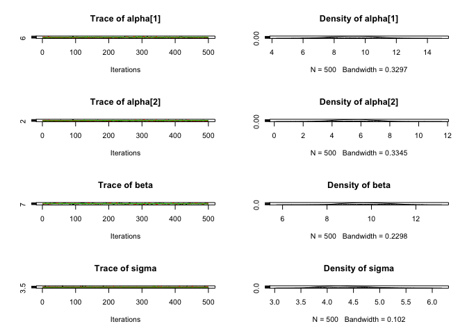
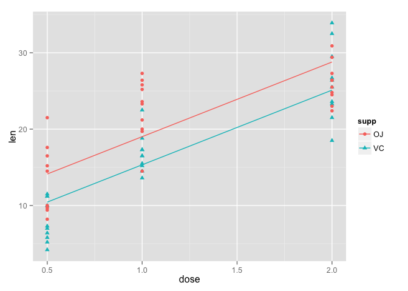
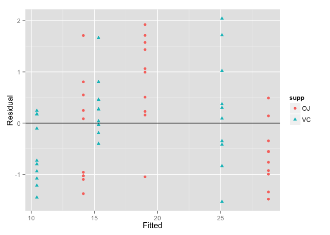
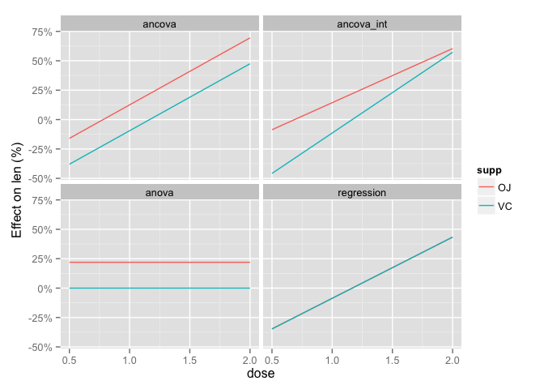

    source("header.R")

    data(ToothGrowth)

    model1 <- jags_model("model {
      for(i in 1:nsupp) {
        alpha[i] ~ dnorm(0, 40^-2)
      }
      beta ~ dnorm(0, 20^-2)
      sigma ~ dunif(0, 20)

      for(i in 1:length(len)) { 
        eLen[i] <- alpha[supp[i]] + beta * dose[i]
        len[i] ~ dnorm(eLen[i], sigma^-2)
      } 
    }",
    derived_code  = " data{
      for(i in 1:length(len)) { 
        prediction[i] <- alpha[supp[i]] + beta * dose[i]
      }
      residual <- (len - prediction) / sigma
    }")

    analysis1 <- jags_analysis(model1, data = ToothGrowth)

    ## Analysis converged (rhat:1.02)

    coef(analysis1)

    ##          estimate lower  upper     sd error significance
    ## alpha[1]    9.238 6.481 11.858 1.3540    29            0
    ## alpha[2]    5.556 2.974  8.263 1.3626    48            0
    ## beta        9.775 7.995 11.592 0.9358    18            0
    ## sigma       4.347 3.661  5.243 0.4186    18            0

    plot(analysis1)

    prediction <- predict(analysis1, newdata = c("supp", "dose"))

    gp <- ggplot(data = prediction, aes(x = dose, y = estimate, color = supp, 
        shape = supp))
    gp <- gp + geom_point(data = dataset(analysis1), aes(y = len))
    gp <- gp + geom_line()
    gp <- gp + scale_y_continuous(name = "len")

    gp

    residuals <- residuals(analysis1)
    residuals$fitted <- fitted(analysis1)$estimate

    qplot(fitted, estimate, color = supp, shape = supp, data = residuals, xlab = "Fitted", 
        ylab = "Residual") + geom_hline(yintercept = 0)

Exercise 11:
------------

    predictive_check(analysis1, newdata = "", 
                     derived_code = "data{ discrepancy <- alpha[1] - alpha[2]}")

    ##             estimate lower upper   sd error significance
    ## discrepancy    3.682 1.373 5.947 1.13    62       0.0013

    ## OR reparameterize the model by setting a base case and an effect

Exercise 13:
------------

    data(ToothGrowth)

    tg_ancova <- jags_model("model {
      for(i in 1:nsupp) {
        alpha[i] ~ dnorm(0, 40^-2)
      }
      beta ~ dnorm(0, 20^-2)
      sigma ~ dunif(0, 20)

      for(i in 1:length(len)) { 
        eLen[i] <- alpha[supp[i]] + beta * dose[i]
        len[i] ~ dnorm(eLen[i], sigma^-2)
      } 
    }",
    derived_code  = " data{
      for(i in 1:length(len)) { 
        prediction[i] <- alpha[supp[i]] + beta * dose[i]
      }
      residual <- (len - prediction) / sigma
    }", 
    model_id = "ancova")

    tg_regression <- jags_model("model {
      alpha ~ dnorm(0, 40^-2)
      beta ~ dnorm(0, 20^-2)
      sigma ~ dunif(0, 20)

      for(i in 1:length(len)) { 
        eLen[i] <- alpha + beta * dose[i]
        len[i] ~ dnorm(eLen[i], sigma^-2)
      } 
    }",
    derived_code  = " data{
      for(i in 1:length(len)) { 
        prediction[i] <- alpha + beta * dose[i]
      }
      residual <- (len - prediction) / sigma
    }", 
    model_id = "regression")

    tg_anova <- jags_model("model {
      for(i in 1:nsupp) {
        alpha[i] ~ dnorm(0, 40^-2)
      }
      sigma ~ dunif(0, 20)

      for(i in 1:length(len)) { 
        eLen[i] <- alpha[supp[i]]
        len[i] ~ dnorm(eLen[i], sigma^-2)
      } 
    }",
    derived_code  = " data{
      for(i in 1:length(len)) { 
        prediction[i] <- alpha[supp[i]]
      }
      residual <- (len - prediction) / sigma
    }", 
    model_id = "anova")

    tg_ancova_int <- jags_model("model {
      for(i in 1:nsupp) {
        alpha[i] ~ dnorm(0, 40^-2)
        beta[i] ~ dnorm(0, 20^-2)
      }
      sigma ~ dunif(0, 20)

      for(i in 1:length(len)) { 
        eLen[i] <- alpha[supp[i]] + beta[supp[i]] * dose[i]
        len[i] ~ dnorm(eLen[i], sigma^-2)
      } 
    }",
    derived_code  = " data{
      for(i in 1:length(len)) { 
        prediction[i] <- alpha[supp[i]] + beta[supp[i]] * dose[i]
      }
      residual <- (len - prediction) / sigma
    }", 
    model_id = "ancova_int")

    models <- combine(tg_ancova, tg_ancova_int, tg_anova, tg_regression)

    tg_analysis <- jags_analysis(models, data = ToothGrowth)

    ## ancova
    ## Analysis converged (rhat:1)
    ## ancova_int
    ## Analysis converged (rhat:1.02)
    ## anova
    ## Analysis converged (rhat:1)
    ## regression
    ## Analysis converged (rhat:1.02)

    prediction <- predict(tg_analysis, newdata = c("supp", "dose"), 
                          model_id = "regression")

    gp <- gp %+% prediction # updates the data in the gp object

Exercise 15:
------------

    model_ids <- model_id(tg_analysis)

    predictions <- data.frame()

    for (id in model_ids) {
      pred <- predict(tg_analysis, newdata = c("supp", "dose"), model_id = id, 
                      base = data.frame(supp = "VC", base = 0.5))
      
      pred$id <- id
      
      predictions <- rbind(predictions, pred)
      
      }

    gp <- ggplot(predictions, aes(x = dose, y = estimate, color = supp, 
                                  shape = supp)) +
      facet_wrap(~ id) +
      geom_line() + 
      scale_y_continuous(name = "Effect on len (%)", labels = percent)

    plot(gp)

