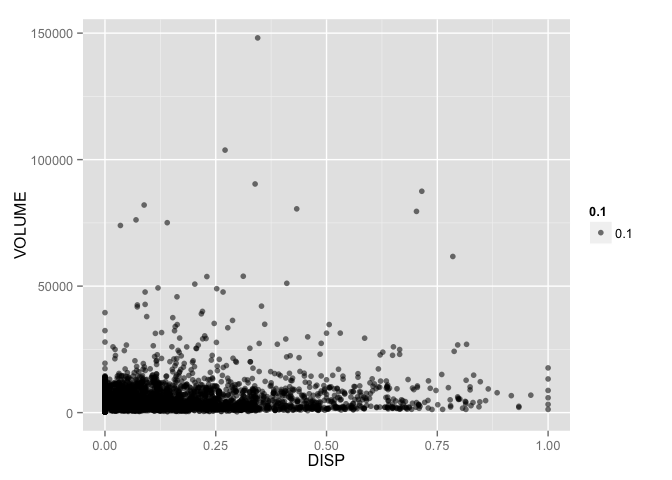
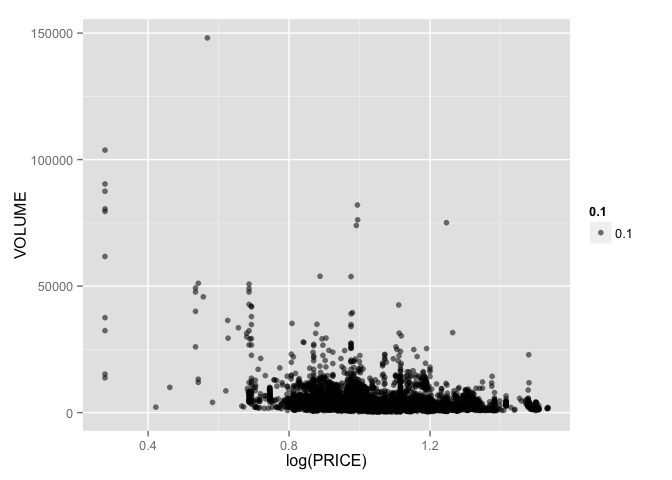

    source("header.R")

    ## 
    ## Attaching package: 'dplyr'
    ## 
    ## The following object is masked from 'package:stats':
    ## 
    ##     filter
    ## 
    ## The following objects are masked from 'package:base':
    ## 
    ##     intersect, setdiff, setequal, union
    ## 
    ## Loading required package: foreach
    ## foreach: simple, scalable parallel programming from Revolution Analytics
    ## Use Revolution R for scalability, fault tolerance and more.
    ## http://www.revolutionanalytics.com
    ## Loading required package: doParallel
    ## Loading required package: iterators
    ## Loading required package: parallel

    library(bayesm)
    data(cheese)

First a few plots:

    qplot(DISP, VOLUME, data = cheese, alpha = 0.1)

    qplot(log(PRICE), VOLUME, data = cheese, alpha = 0.1)

    ## This doesn't converge

    ch_model <- jags_model("model {
      alpha_typical ~ dnorm(0, 20^-2)
      s_alpha ~ dunif(0, 10)
      for (i in 1:nRETAILER) {
        alpha[i] ~ dnorm(0, s_alpha^-2)
      }  ## Vary intercept by retailer
      beta ~ dnorm(0, 2^-2)
      beta2 ~ dnorm(0, 2^-2)
      sigma ~ dunif(0, 2)
      
      for(i in 1:length(VOLUME)) {
        eLogVolume[i] <- alpha_typical + alpha[RETAILER[i]] + beta*DISP[i] + beta2*PRICE[i]
        VOLUME[i] ~ dlnorm(eLogVolume[i], sigma^-2) # Use log-normal dist bc vol can't be negative
      }
    }", 
    random_effects = list(alpha = "RETAILER"), 
    derived_code = "data {
      for(i in 1:length(VOLUME)) {
        log(prediction[i]) <- alpha_typical + alpha[RETAILER[i]] + beta*DISP[i] + beta2*PRICE[i]
      }
    }",
    select_data = c("VOLUME", "log(PRICE)*", "DISP*", "RETAILER"))

    opts_jagr(mode = "report") # Set debug mode so does minimum work to check if it runs
    ch_analysis <- jags_analysis(ch_model, data = cheese)
    plot(ch_analysis)

    price <- predict(ch_analysis, newdata = "PRICE")

    gp <- ggplot(price, aes(x = PRICE, y = estimate)) + 
      geom_line() + 
      geom_line(aes(y = lower), linetype = "dashed") + 
      geom_line(aes(y = upper), linetype = "dashed") + 
      expand_limits(y = 0)
    gp

    disp <- predict(ch_analysis, newdata = "DISP")

    gp %+% disp + aes(x = DISP)

    retailer <- predict(analysis1, newdata = "RETAILER", base = TRUE)

    ggplot(data = retailer, aes(x = RETAILER, y = estimate)) + 
      geom_pointrange(aes(ymin = lower, ymax = upper)) + 
      scale_y_continuous()
