# Peregrine Falcons
Andy Teucher  
November 21, 2014  


```r
source("header.R")
```

```
## 
## Attaching package: 'dplyr'
## 
## The following object is masked from 'package:stats':
## 
##     filter
## 
## The following objects are masked from 'package:base':
## 
##     intersect, setdiff, setequal, union
## 
## Loading required package: foreach
## Loading required package: doParallel
## Loading required package: iterators
## Loading required package: parallel
```


```r
data(peregrine)

model1 <- jags_model("model {
  alpha ~ dnorm(0, 100^-2)
  beta ~ dnorm(0, 100^-2)
  sigma ~ dunif(0, 100)
  
  for(i in 1:length(Pairs)) {
    ePairs[i] <- alpha + beta * Year[i]
    Pairs[i] ~ dnorm(ePairs[i], sigma^-2)
  }
}",
derived_code = "data {
  for(i in 1:length(Pairs)) {
    prediction[i] <- alpha + beta * Year[i]
  }
}",
select_data = c("Pairs", "Year+"))

analysis1 <- jags_analysis(model1, data = peregrine)
```

```
## Analysis converged (rhat:1)
```

```r
coef(analysis1)
```

```
##       estimate lower  upper     sd error significance
## alpha   90.587 84.23 96.681 3.1895     7            0
## beta     4.734  4.21  5.234 0.2622    11            0
## sigma   19.518 15.73 24.343 2.2578    22            0
```

```r
plot(analysis1)
```

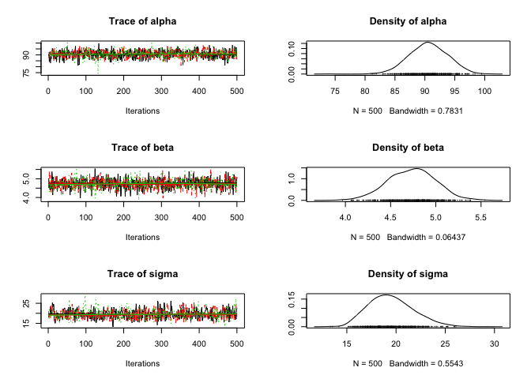 

```r
prediction <- predict(analysis1)

gp <- ggplot(data = prediction, aes(x = Year, y = estimate))
gp <- gp + geom_point(data = dataset(analysis1), aes(y = Pairs))
gp <- gp + geom_line()
gp <- gp + geom_line(aes(y = lower), linetype = "dashed")
gp <- gp + geom_line(aes(y = upper), linetype = "dashed")
gp <- gp + scale_x_continuous(name = "Year")
gp <- gp + scale_y_continuous(name = "Pairs")
gp <- gp + expand_limits(y = 0)

print(gp)
```

 

## Exercise 16 (rerun with year not centered):


```r
select_data(model1) <- c("Pairs", "Year")

analysis2 <- jags_analysis(model1, data = peregrine)
```

```
## Resampling due to convergence failure (rhat:1.52)
## Analysis converged (rhat:1.08)
```

```r
coef(analysis2)
```

```
##        estimate      lower    upper      sd error significance
## alpha -33.27808 -192.58419 175.7241 98.4880   553       0.6653
## beta    0.06152   -0.04496   0.1407  0.0498   151       0.2627
## sigma  59.68918   47.80296  74.9589  6.9690    23       0.0000
```

```r
pred2 <- predict(analysis2)

gp <- gp %+% pred2
gp
```

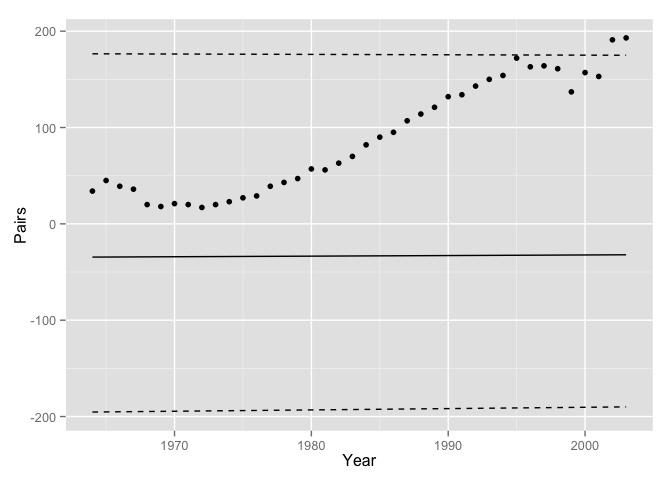 

## Exercise 17 (use a log-link function so can't include 0 Pairs):


```r
data(peregrine)

model1 <- jags_model("model {
  alpha ~ dnorm(0, 100^-2)
  beta ~ dnorm(0, 100^-2)
  sigma ~ dunif(0, 100)
  
  for(i in 1:length(Pairs)) {
    log(ePairs[i]) <- alpha + beta * Year[i] # Add log
    Pairs[i] ~ dnorm(ePairs[i], sigma^-2)
  }
}",
derived_code = "data {
  for(i in 1:length(Pairs)) {
    log(prediction[i]) <- alpha + beta * Year[i] # Add log
  }
}",
select_data = c("Pairs", "Year+"))

analysis1 <- jags_analysis(model1, data = peregrine)
```

```
## Analysis converged (rhat:1.01)
```

```r
coef(analysis1)
```

```
##       estimate    lower    upper       sd error significance
## alpha  4.34424  4.23637  4.43268 0.049476     2            0
## beta   0.05224  0.04586  0.05982 0.003552    13            0
## sigma 19.86331 15.69286 25.55299 2.479800    25            0
```

```r
plot(analysis1)
```

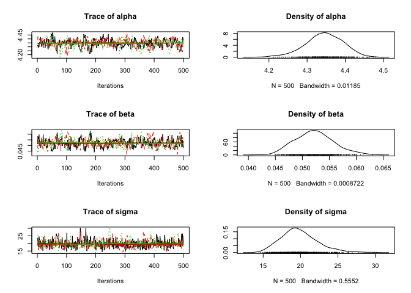 

```r
prediction <- predict(analysis1)

gp <- ggplot(data = prediction, aes(x = Year, y = estimate))
gp <- gp + geom_point(data = dataset(analysis1), aes(y = Pairs))
gp <- gp + geom_line()
gp <- gp + geom_line(aes(y = lower), linetype = "dashed")
gp <- gp + geom_line(aes(y = upper), linetype = "dashed")
gp <- gp + scale_x_continuous(name = "Year")
gp <- gp + scale_y_continuous(name = "Pairs")
gp <- gp + expand_limits(y = 0)

print(gp)
```

 

## Exercise 18 (use poisson distribution):


```r
data(peregrine)

model1 <- jags_model("model {
  alpha ~ dnorm(0, 100^-2)
  beta ~ dnorm(0, 100^-2) 
  # Removed sigma because not used in the model (in pois mean = var)
  
  for(i in 1:length(Pairs)) {
    log(ePairs[i]) <- alpha + beta * Year[i] # Add log
    Pairs[i] ~ dpois(ePairs[i]) # use a Poisson distribution because counts
  }
}",
derived_code = "data {
  for(i in 1:length(Pairs)) {
    log(prediction[i]) <- alpha + beta * Year[i] # Add log
  }
}",
select_data = c("Pairs", "Year+"))

analysis1 <- jags_analysis(model1, data = peregrine)
```

```
## Analysis converged (rhat:1)
```

```r
coef(analysis1)
```

```
##       estimate   lower   upper       sd error significance
## alpha  4.29549 4.25612 4.33646 0.020351     1            0
## beta   0.05807 0.05496 0.06118 0.001605     5            0
```

```r
plot(analysis1)
```

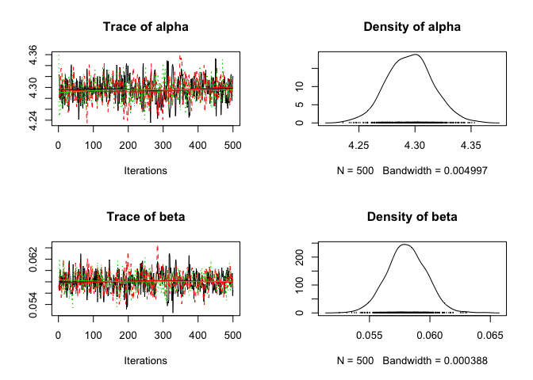 

```r
prediction <- predict(analysis1)

gp <- ggplot(data = prediction, aes(x = Year, y = estimate))
gp <- gp + geom_point(data = dataset(analysis1), aes(y = Pairs))
gp <- gp + geom_line()
gp <- gp + geom_line(aes(y = lower), linetype = "dashed")
gp <- gp + geom_line(aes(y = upper), linetype = "dashed")
gp <- gp + scale_x_continuous(name = "Year")
gp <- gp + scale_y_continuous(name = "Pairs")
gp <- gp + expand_limits(y = 0)

print(gp)
```

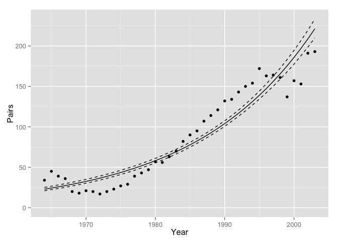 

### A bit of off-roading to look at over-dispersed poisson:

This adds a new parameter with a gamma distribution to introduce more variation
in the point estimates


```r
data(peregrine)

model1 <- jags_model("model {
  alpha ~ dnorm(0, 100^-2)
  beta ~ dnorm(0, 100^-2) 
  sDispersion ~ dunif(0,5)
  
  for(i in 1:length(Pairs)) {
    eDispersion[i] ~ dgamma(1 / sDispersion^2, 1 / sDispersion^2)
    log(ePairs[i]) <- alpha + beta * Year[i] # Add log
    Pairs[i] ~ dpois(ePairs[i] * eDispersion[i]) # include dispersion
  }
}",
derived_code = "data {
  for(i in 1:length(Pairs)) {
    log(prediction[i]) <- alpha + beta * Year[i] # Add log
  }
}",
select_data = c("Pairs", "Year+"))

analysis1 <- jags_analysis(model1, data = peregrine)
```

```
## Analysis converged (rhat:1.03)
```

```r
coef(analysis1)
```

```
##             estimate   lower   upper       sd error significance
## alpha        4.28638 4.20477 4.37523 0.041935     2            0
## beta         0.06073 0.05345 0.06833 0.003879    12            0
## sDispersion  0.26049 0.18978 0.35076 0.041505    31            0
```

```r
plot(analysis1)
```

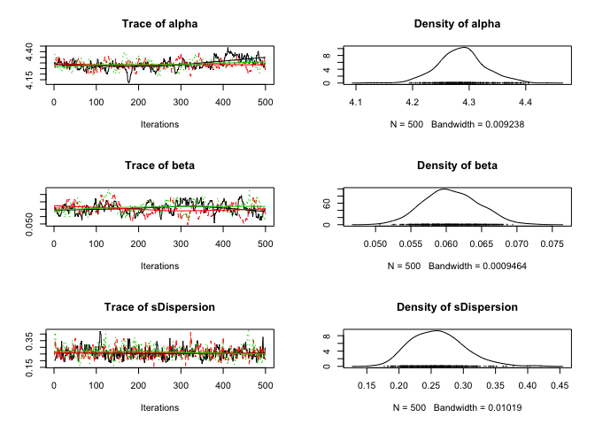 

```r
prediction <- predict(analysis1)

gp <- ggplot(data = prediction, aes(x = Year, y = estimate))
gp <- gp + geom_point(data = dataset(analysis1), aes(y = Pairs))
gp <- gp + geom_line()
gp <- gp + geom_line(aes(y = lower), linetype = "dashed")
gp <- gp + geom_line(aes(y = upper), linetype = "dashed")
gp <- gp + scale_x_continuous(name = "Year")
gp <- gp + scale_y_continuous(name = "Pairs")
gp <- gp + expand_limits(y = 0)

print(gp)
```

 

## Exercise 19:

Add a second-order (quadratic) polynomial to the overdispersed model


```r
data(peregrine)

model1 <- jags_model("model {
  alpha ~ dnorm(0, 100^-2)
  beta ~ dnorm(0, 100^-2)
  beta2 ~ dnorm(0, 100^-2)
  beta3 ~ dnorm(0, 100^-2)
  sDispersion ~ dunif(0,5)
  
  for(i in 1:length(Pairs)) {
    eDispersion[i] ~ dgamma(1 / sDispersion^2, 1 / sDispersion^2)
    log(ePairs[i]) <- alpha + beta * Year[i] + beta2 * Year[i]^2 + beta3 * Year[i]^3
    Pairs[i] ~ dpois(ePairs[i] * eDispersion[i]) # include dispersion
  }
}",
derived_code = "data {
  for(i in 1:length(Pairs)) {
    log(prediction[i]) <- alpha + beta * Year[i] + beta2 * Year[i]^2 + beta3 * Year[i]^3
  }
}",
select_data = c("Pairs", "Year+"))

analysis1 <- jags_analysis(model1, data = peregrine)
```

```
## Resampling due to convergence failure (rhat:2.04)
## Resampling due to convergence failure (rhat:1.15)
## Analysis converged (rhat:1.01)
```

```r
coef(analysis1)
```

```
##               estimate      lower      upper        sd error significance
## alpha        4.2643576  4.1799494  4.3460680 0.0418630     2       0.0000
## beta         0.1027073  0.0921903  0.1149652 0.0059563    11       0.0000
## beta2       -0.0001097 -0.0006174  0.0003648 0.0002424   448       0.6187
## beta3       -0.0001727 -0.0002182 -0.0001337 0.0000219    24       0.0000
## sDispersion  0.1185657  0.0630187  0.1834332 0.0315710    51       0.0000
```

```r
plot(analysis1)
```

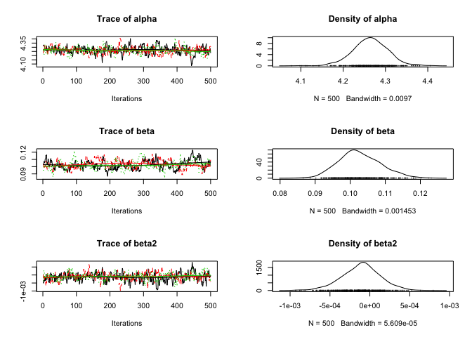 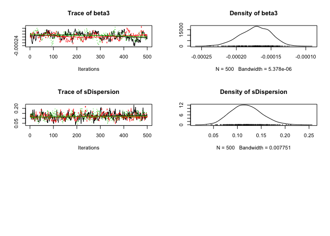 

```r
prediction <- predict(analysis1)

gp <- ggplot(data = prediction, aes(x = Year, y = estimate))
gp <- gp + geom_point(data = dataset(analysis1), aes(y = Pairs))
gp <- gp + geom_line()
gp <- gp + geom_line(aes(y = lower), linetype = "dashed")
gp <- gp + geom_line(aes(y = upper), linetype = "dashed")
gp <- gp + scale_x_continuous(name = "Year")
gp <- gp + scale_y_continuous(name = "Pairs")
gp <- gp + expand_limits(y = 0)

print(gp)
```

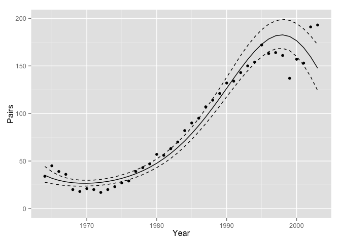 

Note that the support for the `sDispersion` parameter is decreasing as the third order polynomial is explaining more of the variation. The percent error is still relatively low (~50, wich is < 80), so we will keep it.

## Exercise 21:


```r
pred2 <- predict(analysis1, newdata = data.frame(Year = as.integer(2006)))
```

The third-order polynomial predicts that there will be 103.7439 in 2006.

## State-Space Population Growth Models


```r
data(peregrine)

model6 <- jags_model("model {
  mean_r ~ dnorm(0, 1^-2)
  sd_r ~ dunif(0, 1)
  logN[1] ~ dnorm(0, 10^-2)
  
  for(i in 2:nYear) {
    r[i-1] ~ dnorm(mean_r, sd_r^-2)
    logN[i] <- logN[i-1] + r[i-1]
  }
  
  for(i in 1:length(Pairs)) {
    Pairs[i] ~ dpois(exp(logN[Year[i]]))
  }
  
  logN1 <- logN[1]
}",
derived_code = "data {
  for(i in 1:length(Pairs)) {
    log(prediction[i]) <- logN[Year[i]]
  }
}",
select_data = c("Pairs", "Year"),
random_effects = list(r = "Year", logN = "Year"))

## Need Year as a factor for the loop
peregrine$Year <- factor(peregrine$Year)
analysis_ss <- jags_analysis(model6, data = peregrine)
```

```
## Resampling due to convergence failure (rhat:1.39)
## Resampling due to convergence failure (rhat:1.22)
## Resampling due to convergence failure (rhat:1.12)
## Analysis converged (rhat:1.04)
```

```r
coef(analysis_ss)
```

```
##        estimate    lower   upper     sd error significance
## logN1   3.54495 3.259986 3.79735 0.1384     8       0.0000
## mean_r  0.04399 0.005716 0.08564 0.0203    91       0.0253
## sd_r    0.12684 0.087228 0.18334 0.0244    38       0.0000
```

```r
prediction <- predict(analysis_ss)

gp <- ggplot(data = prediction, 
             aes(x = as.integer(as.character(Year)), y = estimate))
gp <- gp + geom_point(data = dataset(analysis_ss), aes(y = Pairs))
gp <- gp + geom_line()
gp <- gp + geom_line(aes(y = lower), linetype = "dashed")
gp <- gp + geom_line(aes(y = upper), linetype = "dashed")
gp <- gp + scale_x_continuous(name = "Year")
gp <- gp + scale_y_continuous(name = "Pairs")
gp <- gp + expand_limits(y = 0)

print(gp)
```

 

## Exercise 22:


```r
## Predict as percent change since 1970
prediction <- predict(analysis_ss, base = data.frame(Year = as.factor(1970)))

gp <- ggplot(data = prediction, 
             aes(x = as.integer(as.character(Year)), y = estimate))
gp <- gp + geom_line()
gp <- gp + geom_line(aes(y = lower), linetype = "dashed")
gp <- gp + geom_line(aes(y = upper), linetype = "dashed")
gp <- gp + scale_x_continuous(name = "Year")
gp <- gp + scale_y_continuous(name = "% Change since 1970")
gp <- gp + expand_limits(y = 0)

print(gp)
```

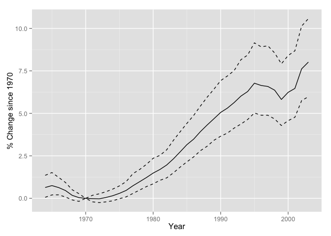 

The estimated percent change in 2003 since 1970 is 8.0173 (95% CI: 5.979 to 10.5737)

## Exercise 23:

Predict years up to 2008:


```r
data(peregrine)

## Add the years you want to predict for
peregrine_padded <- left_join(data.frame(Year = min(peregrine$Year):2008), 
                       peregrine)
```

```
## Joining by: "Year"
```

```r
## Need Year as a factor for the loop
peregrine_padded$Year <- factor(peregrine_padded$Year)
analysis_pred <- jags_analysis(model6, data = peregrine_padded)
```

```
## Resampling due to convergence failure (rhat:1.4)
## Resampling due to convergence failure (rhat:1.18)
## Analysis converged (rhat:1.09)
```

```r
coef(analysis_pred)
```

```
##        estimate    lower   upper      sd error significance
## logN1   3.52425 3.276147 3.78699 0.12892     7       0.0000
## mean_r  0.04454 0.004404 0.08544 0.02100    91       0.0333
## sd_r    0.12583 0.087418 0.17898 0.02328    36       0.0000
```

```r
prediction_pred <- predict(analysis_pred)

gp <- ggplot(data = prediction_pred, 
             aes(x = as.integer(as.character(Year)), y = estimate))
gp <- gp + geom_point(data = dataset(analysis_pred), aes(y = Pairs))
gp <- gp + geom_line()
gp <- gp + geom_line(aes(y = lower), linetype = "dashed")
gp <- gp + geom_line(aes(y = upper), linetype = "dashed")
gp <- gp + scale_x_continuous(name = "Year")
gp <- gp + scale_y_continuous(name = "Pairs")
gp <- gp + expand_limits(y = 0)

print(gp)
```

```
## Warning: Removed 5 rows containing missing values (geom_point).
```

 

## Exercise 25: Breeding Success

Add a second-order polynial to original linear model


```r
data(peregrine)

peregrine$Proportion <- peregrine$R.Pairs / peregrine$Pairs

model1 <- jags_model("model {
  alpha ~ dnorm(0, 1^-2)
  beta ~ dnorm(0, 1^-2)
  beta2 ~ dnorm(0, 1^-2) ## Added beta2
  sigma ~ dunif(0, 1)
  
  for(i in 1:length(Proportion)) {
    eProportion[i] <- alpha + beta * Year[i] + beta2*Year[i]^2 ## Add the quadratic term
    Proportion[i] ~ dnorm(eProportion[i], sigma^-2)
  }
}",
derived_code = "data {
  for(i in 1:length(Proportion)) {
    prediction[i] <- alpha + beta * Year[i] + beta2*Year[i]^2 ## Quadratic here too
  }
}",
select_data = c("Proportion", "Year+"))

analysis1 <- jags_analysis(model1, data = peregrine)
```

```
## Analysis converged (rhat:1)
```

```r
prediction <- predict(analysis1)

gp <- ggplot(data = prediction, aes(x = Year, y = estimate))
gp <- gp + geom_point(data = dataset(analysis1), aes(y = Proportion))
gp <- gp + geom_line()
gp <- gp + geom_line(aes(y = lower), linetype = "dashed")
gp <- gp + geom_line(aes(y = upper), linetype = "dashed")
gp <- gp + scale_x_continuous(name = "Year")
gp <- gp + scale_y_continuous(name = "Pairs")
gp <- gp + expand_limits(y = c(0, 1))

print(gp)
```

 

But there is a problem: the polynomial could allow expected values of < 0 or > 1.
Use a logistic link function...

## Exercise 26:


```r
data(peregrine)

peregrine$Proportion <- peregrine$R.Pairs / peregrine$Pairs

model1 <- jags_model("model {
  alpha ~ dnorm(0, 1^-2)
  beta ~ dnorm(0, 1^-2)
  beta2 ~ dnorm(0, 1^-2) ## Added beta2
  sigma ~ dunif(0, 1)
  
  for(i in 1:length(Proportion)) {
    logit(eProportion[i]) <- alpha + beta * Year[i] + beta2*Year[i]^2
    Proportion[i] ~ dnorm(eProportion[i], sigma^-2)
  }
}",
derived_code = "data {
  for(i in 1:length(Proportion)) {
    logit(prediction[i]) <- alpha + beta * Year[i] + beta2*Year[i]^2 ## Quadratic here too
  }
}",
select_data = c("Proportion", "Year+"))

analysis1 <- jags_analysis(model1, data = peregrine)
```

```
## Analysis converged (rhat:1.01)
```

```r
prediction <- predict(analysis1)

gp <- ggplot(data = prediction, aes(x = Year, y = estimate))
gp <- gp + geom_point(data = dataset(analysis1), aes(y = Proportion))
gp <- gp + geom_line()
gp <- gp + geom_line(aes(y = lower), linetype = "dashed")
gp <- gp + geom_line(aes(y = upper), linetype = "dashed")
gp <- gp + scale_x_continuous(name = "Year")
gp <- gp + scale_y_continuous(name = "Pairs")
gp <- gp + expand_limits(y = c(0, 1))

print(gp)
```

 

```r
## Look at tails to see it now doesn't go to zero:
pred <- predict(analysis1, data.frame(Year = 1940:2025))
gp %+% pred
```

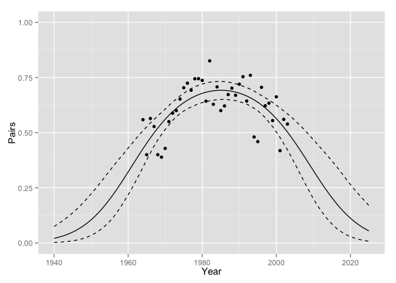 

## Exercise 27:


```r
data(peregrine)

peregrine$Proportion <- peregrine$R.Pairs / peregrine$Pairs

model1 <- jags_model("model {
  alpha ~ dnorm(0, 1^-2)
  beta ~ dnorm(0, 1^-2)
  beta2 ~ dnorm(0, 1^-2) ## Added beta2
  
  for(i in 1:length(Pairs)) {
    logit(eProportion[i]) <- alpha + beta * Year[i] + beta2*Year[i]^2
    R.Pairs[i] ~ dbin(eProportion[i], Pairs[i])
  }
}",
derived_code = "data {
  for(i in 1:length(Pairs)) {
    logit(prediction[i]) <- alpha + beta * Year[i] + beta2*Year[i]^2
  }
}",
select_data = c("Year+", "Pairs", "R.Pairs"))

analysis1 <- jags_analysis(model1, data = peregrine)
```

```
## Analysis converged (rhat:1.02)
```

```r
prediction <- predict(analysis1)

gp <- ggplot(data = prediction, aes(x = Year, y = estimate))
gp <- gp + geom_point(data = dataset(analysis1), aes(y = Proportion))
gp <- gp + geom_line()
gp <- gp + geom_line(aes(y = lower), linetype = "dashed")
gp <- gp + geom_line(aes(y = upper), linetype = "dashed")
gp <- gp + scale_x_continuous(name = "Year")
gp <- gp + scale_y_continuous(name = "Pairs")
gp <- gp + expand_limits(y = c(0, 1))

print(gp)
```

 

## Exercise 29: Add overdispersion to binomial distribution


```r
data(peregrine)

peregrine$Proportion <- peregrine$R.Pairs / peregrine$Pairs

model1 <- jags_model("model {
  alpha ~ dnorm(0, 1^-2)
  beta ~ dnorm(0, 1^-2)
  beta2 ~ dnorm(0, 1^-2)
  sDispersion ~ dunif(0,5) ## Add prior for overdispersion parameter
  
  for(i in 1:length(Pairs)) {
    eDispersion[i] ~ dnorm(0, sDispersion^-2)
    logit(eProportion[i]) <- alpha + beta * Year[i] + beta2*Year[i]^2 + eDispersion[i]
    R.Pairs[i] ~ dbin(eProportion[i], Pairs[i])
  }
}",
derived_code = "data {
  for(i in 1:length(Pairs)) {
    logit(prediction[i]) <- alpha + beta * Year[i] + beta2*Year[i]^2
  }
}",
select_data = c("Year+", "Pairs", "R.Pairs"))

analysis1 <- jags_analysis(model1, data = peregrine)
```

```
## Analysis converged (rhat:1.06)
```

```r
coef(analysis1)
```

```
##              estimate     lower     upper        sd error significance
## alpha        0.815258  0.624448  1.005283 0.0961870    23        0.000
## beta         0.003104 -0.009397  0.014979 0.0059483   393        0.604
## beta2       -0.002411 -0.003383 -0.001385 0.0005326    41        0.000
## sDispersion  0.304458  0.204970  0.423524 0.0569100    36        0.000
```

```r
prediction <- predict(analysis1)

gp <- ggplot(data = prediction, aes(x = Year, y = estimate))
gp <- gp + geom_point(data = dataset(analysis1), aes(y = Proportion))
gp <- gp + geom_line()
gp <- gp + geom_line(aes(y = lower), linetype = "dashed")
gp <- gp + geom_line(aes(y = upper), linetype = "dashed")
gp <- gp + scale_x_continuous(name = "Year")
gp <- gp + scale_y_continuous(name = "Pairs")
gp <- gp + expand_limits(y = c(0, 1))

print(gp)
```

 

The percent error in the coefficient table for sDispersion is relatively low, so unlikely to include zero.  This means it's probably important.

## Add overdispersion correction to AR model:


```r
model2 <- jags_model("model {
  theta[1] ~ dnorm(0, 2^-2)
  sigma ~ dunif(0, 2)
  for(i in 2:length(R.Pairs)) {
    theta[i] ~ dnorm(theta[i-1], sigma^-2)
  }
  sDispersion ~ dunif(0, 5)
  
  for(i in 1:length(R.Pairs)) {
    eDispersion[i] ~ dnorm(0, sDispersion^-2)
    logit(eProportion[i]) <- theta[i] + eDispersion[i]
    R.Pairs[i] ~ dbin(eProportion[i], Pairs[i])
  }
}",
derived_code = "data {
  for(i in 1:length(R.Pairs)) {
    logit(prediction[i]) <- theta[Year[i]]
  }
}",
random_effect = list(theta = "Year"),
select_data = c("R.Pairs", "Pairs", "Year"))

data(peregrine)
peregrine$Year <- factor(peregrine$Year)

analysis2 <- jags_analysis(model2, data = peregrine)
```

```
## Resampling due to convergence failure (rhat:1.28)
## Resampling due to convergence failure (rhat:1.19)
## Analysis converged (rhat:1.02)
```

```r
prediction <- predict(analysis2)

gp <- gp + aes(as.integer(as.character(Year)))
gp <- gp %+% prediction

print(gp)
```

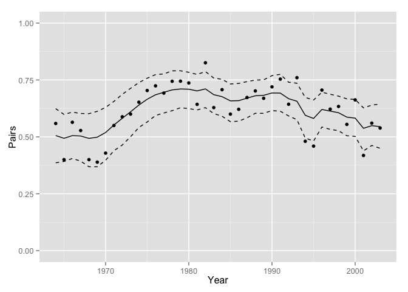 

