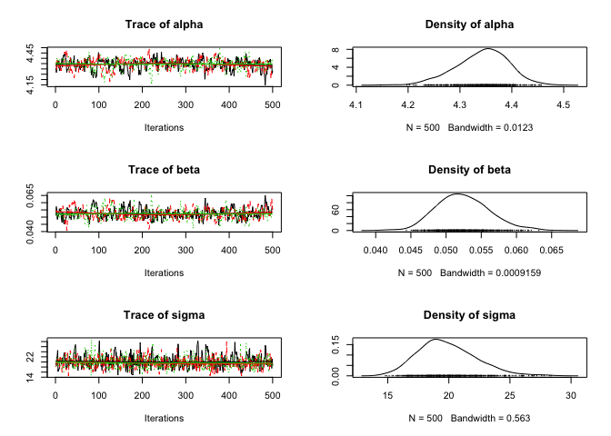
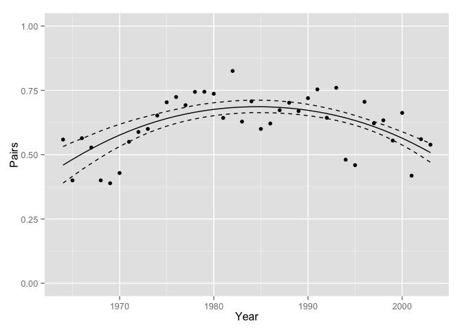

    source("header.R")

    data(peregrine)

    model1 <- jags_model("model {
      alpha ~ dnorm(0, 100^-2)
      beta ~ dnorm(0, 100^-2)
      sigma ~ dunif(0, 100)
      
      for(i in 1:length(Pairs)) {
        ePairs[i] <- alpha + beta * Year[i]
        Pairs[i] ~ dnorm(ePairs[i], sigma^-2)
      }
    }",
    derived_code = "data {
      for(i in 1:length(Pairs)) {
        prediction[i] <- alpha + beta * Year[i]
      }
    }",
    select_data = c("Pairs", "Year+"))

    analysis1 <- jags_analysis(model1, data = peregrine)

    ## Analysis converged (rhat:1)

    coef(analysis1)

    ##       estimate  lower  upper     sd error significance
    ## alpha   90.689 84.350 96.620 3.1612     7            0
    ## beta     4.745  4.199  5.286 0.2681    11            0
    ## sigma   19.578 15.384 25.105 2.4602    25            0

    plot(analysis1)

    prediction <- predict(analysis1)

    gp <- ggplot(data = prediction, aes(x = Year, y = estimate))
    gp <- gp + geom_point(data = dataset(analysis1), aes(y = Pairs))
    gp <- gp + geom_line()
    gp <- gp + geom_line(aes(y = lower), linetype = "dashed")
    gp <- gp + geom_line(aes(y = upper), linetype = "dashed")
    gp <- gp + scale_x_continuous(name = "Year")
    gp <- gp + scale_y_continuous(name = "Pairs")
    gp <- gp + expand_limits(y = 0)

    print(gp)

Exercise 16 (rerun with year not centered):
-------------------------------------------

    select_data(model1) <- c("Pairs", "Year")

    analysis2 <- jags_analysis(model1, data = peregrine)

    ## Resampling due to convergence failure (rhat:1.75)
    ## Resampling due to convergence failure (rhat:1.11)
    ## Analysis converged (rhat:1.03)

    coef(analysis2)

    ##        estimate      lower    upper        sd error significance
    ## alpha -45.12904 -253.22055 130.6500 100.35000   425       0.7347
    ## beta    0.06742   -0.02132   0.1719   0.05072   143       0.1427
    ## sigma  59.22855   47.63219  72.9710   6.59700    21       0.0000

    pred2 <- predict(analysis2)

    gp <- gp %+% pred2
    gp

Exercise 17 (use a log-link function so can't include 0 Pairs):
---------------------------------------------------------------

    data(peregrine)

    model1 <- jags_model("model {
      alpha ~ dnorm(0, 100^-2)
      beta ~ dnorm(0, 100^-2)
      sigma ~ dunif(0, 100)
      
      for(i in 1:length(Pairs)) {
        log(ePairs[i]) <- alpha + beta * Year[i] # Add log
        Pairs[i] ~ dnorm(ePairs[i], sigma^-2)
      }
    }",
    derived_code = "data {
      for(i in 1:length(Pairs)) {
        log(prediction[i]) <- alpha + beta * Year[i] # Add log
      }
    }",
    select_data = c("Pairs", "Year+"))

    analysis1 <- jags_analysis(model1, data = peregrine)

    ## Analysis converged (rhat:1.02)

    coef(analysis1)

    ##       estimate    lower    upper       sd error significance
    ## alpha  4.34243  4.23636  4.43344 0.050457     2            0
    ## beta   0.05243  0.04592  0.06066 0.003736    14            0
    ## sigma 19.86231 15.83778 24.97973 2.366500    23            0

    plot(analysis1)

    prediction <- predict(analysis1)

    gp <- ggplot(data = prediction, aes(x = Year, y = estimate))
    gp <- gp + geom_point(data = dataset(analysis1), aes(y = Pairs))
    gp <- gp + geom_line()
    gp <- gp + geom_line(aes(y = lower), linetype = "dashed")
    gp <- gp + geom_line(aes(y = upper), linetype = "dashed")
    gp <- gp + scale_x_continuous(name = "Year")
    gp <- gp + scale_y_continuous(name = "Pairs")
    gp <- gp + expand_limits(y = 0)

    print(gp)

Exercise 18 (use poisson distribution):
---------------------------------------

    data(peregrine)

    model1 <- jags_model("model {
      alpha ~ dnorm(0, 100^-2)
      beta ~ dnorm(0, 100^-2) 
      # Removed sigma because not used in the model (in pois mean = var)
      
      for(i in 1:length(Pairs)) {
        log(ePairs[i]) <- alpha + beta * Year[i] # Add log
        Pairs[i] ~ dpois(ePairs[i]) # use a Poisson distribution because counts
      }
    }",
    derived_code = "data {
      for(i in 1:length(Pairs)) {
        log(prediction[i]) <- alpha + beta * Year[i] # Add log
      }
    }",
    select_data = c("Pairs", "Year+"))

    analysis1 <- jags_analysis(model1, data = peregrine)

    ## Analysis converged (rhat:1)

    coef(analysis1)

    ##       estimate   lower   upper       sd error significance
    ## alpha  4.29438 4.25314 4.33341 0.019987     1            0
    ## beta   0.05823 0.05507 0.06149 0.001642     6            0

    plot(analysis1)

    prediction <- predict(analysis1)

    gp <- ggplot(data = prediction, aes(x = Year, y = estimate))
    gp <- gp + geom_point(data = dataset(analysis1), aes(y = Pairs))
    gp <- gp + geom_line()
    gp <- gp + geom_line(aes(y = lower), linetype = "dashed")
    gp <- gp + geom_line(aes(y = upper), linetype = "dashed")
    gp <- gp + scale_x_continuous(name = "Year")
    gp <- gp + scale_y_continuous(name = "Pairs")
    gp <- gp + expand_limits(y = 0)

    print(gp)

### A bit of off-roading to look at over-dispersed poisson:

This adds a new parameter with a gamma distribution to introduce more
variation in the point estimates

    data(peregrine)

    model1 <- jags_model("model {
      alpha ~ dnorm(0, 100^-2)
      beta ~ dnorm(0, 100^-2) 
      sDispersion ~ dunif(0,5)
      
      for(i in 1:length(Pairs)) {
        eDispersion[i] ~ dgamma(1 / sDispersion^2, 1 / sDispersion^2)
        log(ePairs[i]) <- alpha + beta * Year[i] # Add log
        Pairs[i] ~ dpois(ePairs[i] * eDispersion[i]) # include dispersion
      }
    }",
    derived_code = "data {
      for(i in 1:length(Pairs)) {
        log(prediction[i]) <- alpha + beta * Year[i] # Add log
      }
    }",
    select_data = c("Pairs", "Year+"))

    analysis1 <- jags_analysis(model1, data = peregrine)

    ## Analysis converged (rhat:1.01)

    coef(analysis1)

    ##             estimate  lower   upper       sd error significance
    ## alpha        4.29288 4.1996 4.38837 0.050965     2            0
    ## beta         0.06115 0.0529 0.06873 0.003918    13            0
    ## sDispersion  0.25938 0.1891 0.34455 0.040054    30            0

    plot(analysis1)

    prediction <- predict(analysis1)

    gp <- ggplot(data = prediction, aes(x = Year, y = estimate))
    gp <- gp + geom_point(data = dataset(analysis1), aes(y = Pairs))
    gp <- gp + geom_line()
    gp <- gp + geom_line(aes(y = lower), linetype = "dashed")
    gp <- gp + geom_line(aes(y = upper), linetype = "dashed")
    gp <- gp + scale_x_continuous(name = "Year")
    gp <- gp + scale_y_continuous(name = "Pairs")
    gp <- gp + expand_limits(y = 0)

    print(gp)

Exercise 19:
------------

Add a second-order (quadratic) polynomial to the overdispersed model

    data(peregrine)

    model1 <- jags_model("model {
      alpha ~ dnorm(0, 100^-2)
      beta ~ dnorm(0, 100^-2)
      beta2 ~ dnorm(0, 100^-2)
      beta3 ~ dnorm(0, 100^-2)
      sDispersion ~ dunif(0,5)
      
      for(i in 1:length(Pairs)) {
        eDispersion[i] ~ dgamma(1 / sDispersion^2, 1 / sDispersion^2)
        log(ePairs[i]) <- alpha + beta * Year[i] + beta2 * Year[i]^2 + beta3 * Year[i]^3
        Pairs[i] ~ dpois(ePairs[i] * eDispersion[i]) # include dispersion
      }
    }",
    derived_code = "data {
      for(i in 1:length(Pairs)) {
        log(prediction[i]) <- alpha + beta * Year[i] + beta2 * Year[i]^2 + beta3 * Year[i]^3
      }
    }",
    select_data = c("Pairs", "Year+"))

    analysis1 <- jags_analysis(model1, data = peregrine)

    ## Resampling due to convergence failure (rhat:2.06)
    ## Analysis converged (rhat:1.03)

    coef(analysis1)

    ##               estimate      lower      upper        sd error significance
    ## alpha        4.2591105  4.1678519  4.3380606 4.245e-02     2         0.00
    ## beta         0.1029423  0.0915520  0.1156088 6.116e-03    12         0.00
    ## beta2       -0.0000920 -0.0005523  0.0003869 2.352e-04   510         0.66
    ## beta3       -0.0001737 -0.0002225 -0.0001322 2.267e-05    26         0.00
    ## sDispersion  0.1137300  0.0520330  0.1728584 3.115e-02    53         0.00

    plot(analysis1)

    prediction <- predict(analysis1)

    gp <- ggplot(data = prediction, aes(x = Year, y = estimate))
    gp <- gp + geom_point(data = dataset(analysis1), aes(y = Pairs))
    gp <- gp + geom_line()
    gp <- gp + geom_line(aes(y = lower), linetype = "dashed")
    gp <- gp + geom_line(aes(y = upper), linetype = "dashed")
    gp <- gp + scale_x_continuous(name = "Year")
    gp <- gp + scale_y_continuous(name = "Pairs")
    gp <- gp + expand_limits(y = 0)

    print(gp)

Note that the support for the `sDispersion` parameter is decreasing as
the third order polynomial is explaining more of the variation. The
percent error is still relatively low (~50, wich is \< 80), so we will
keep it.

Exercise 21:
------------

    pred2 <- predict(analysis1, newdata = data.frame(Year = as.integer(2006)))

The third-order polynomial predicts that there will be 103.5877 in 2006.

State-Space Population Growth Models
------------------------------------

    data(peregrine)

    model6 <- jags_model("model {
      mean_r ~ dnorm(0, 1^-2)
      sd_r ~ dunif(0, 1)
      logN[1] ~ dnorm(0, 10^-2)
      
      for(i in 2:nYear) {
        r[i-1] ~ dnorm(mean_r, sd_r^-2)
        logN[i] <- logN[i-1] + r[i-1]
      }
      
      for(i in 1:length(Pairs)) {
        Pairs[i] ~ dpois(exp(logN[Year[i]]))
      }
      
      logN1 <- logN[1]
    }",
    derived_code = "data {
      for(i in 1:length(Pairs)) {
        log(prediction[i]) <- logN[Year[i]]
      }
    }",
    select_data = c("Pairs", "Year"),
    random_effects = list(r = "Year", logN = "Year"))

    ## Need Year as a factor for the loop
    peregrine$Year <- factor(peregrine$Year)
    analysis_ss <- jags_analysis(model6, data = peregrine)

    ## Resampling due to convergence failure (rhat:1.51)
    ## Resampling due to convergence failure (rhat:1.16)
    ## Analysis converged (rhat:1.08)

    coef(analysis_ss)

    ##        estimate     lower   upper      sd error significance
    ## logN1   3.51233 3.2542627 3.75757 0.12949     7        0.000
    ## mean_r  0.04535 0.0002563 0.08777 0.02159    96        0.048
    ## sd_r    0.12920 0.0921150 0.17872 0.02230    34        0.000

    prediction <- predict(analysis_ss)

    gp <- ggplot(data = prediction, 
                 aes(x = as.integer(as.character(Year)), y = estimate))
    gp <- gp + geom_point(data = dataset(analysis_ss), aes(y = Pairs))
    gp <- gp + geom_line()
    gp <- gp + geom_line(aes(y = lower), linetype = "dashed")
    gp <- gp + geom_line(aes(y = upper), linetype = "dashed")
    gp <- gp + scale_x_continuous(name = "Year")
    gp <- gp + scale_y_continuous(name = "Pairs")
    gp <- gp + expand_limits(y = 0)

    print(gp)

Exercise 22:
------------

    ## Predict as percent change since 1970
    prediction <- predict(analysis_ss, base = data.frame(Year = as.factor(1970)))

    gp <- ggplot(data = prediction, 
                 aes(x = as.integer(as.character(Year)), y = estimate))
    gp <- gp + geom_line()
    gp <- gp + geom_line(aes(y = lower), linetype = "dashed")
    gp <- gp + geom_line(aes(y = upper), linetype = "dashed")
    gp <- gp + scale_x_continuous(name = "Year")
    gp <- gp + scale_y_continuous(name = "% Change since 1970")
    gp <- gp + expand_limits(y = 0)

    print(gp)

The estimated percent change in 2003 since 1970 is 8.0287 (95% CI:
5.9144 to 10.4366)

Exercise 23:
------------

Predict years up to 2008:

    data(peregrine)

    ## Add the years you want to predict for
    peregrine_padded <- left_join(data.frame(Year = min(peregrine$Year):2008), 
                           peregrine)

    ## Joining by: "Year"

    ## Need Year as a factor for the loop
    peregrine_padded$Year <- factor(peregrine_padded$Year)
    analysis_pred <- jags_analysis(model6, data = peregrine_padded)

    ## Resampling due to convergence failure (rhat:1.25)
    ## Resampling due to convergence failure (rhat:1.23)
    ## Analysis converged (rhat:1.09)

    coef(analysis_pred)

    ##        estimate    lower   upper      sd error significance
    ## logN1    3.5706 3.297243 3.83857 0.14192     8       0.0000
    ## mean_r   0.0432 0.002089 0.08496 0.02107    96       0.0387
    ## sd_r     0.1294 0.090090 0.18062 0.02269    35       0.0000

    prediction_pred <- predict(analysis_pred)

    gp <- ggplot(data = prediction_pred, 
                 aes(x = as.integer(as.character(Year)), y = estimate))
    gp <- gp + geom_point(data = dataset(analysis_pred), aes(y = Pairs))
    gp <- gp + geom_line()
    gp <- gp + geom_line(aes(y = lower), linetype = "dashed")
    gp <- gp + geom_line(aes(y = upper), linetype = "dashed")
    gp <- gp + scale_x_continuous(name = "Year")
    gp <- gp + scale_y_continuous(name = "Pairs")
    gp <- gp + expand_limits(y = 0)

    print(gp)

    ## Warning: Removed 5 rows containing missing values (geom_point).

Exercise 25: Breeding Success
-----------------------------

Add a second-order polynial to original linear model

    data(peregrine)

    peregrine$Proportion <- peregrine$R.Pairs / peregrine$Pairs

    model1 <- jags_model("model {
      alpha ~ dnorm(0, 1^-2)
      beta ~ dnorm(0, 1^-2)
      beta2 ~ dnorm(0, 1^-2) ## Added beta2
      sigma ~ dunif(0, 1)
      
      for(i in 1:length(Proportion)) {
        eProportion[i] <- alpha + beta * Year[i] + beta2*Year[i]^2 ## Add the quadratic term
        Proportion[i] ~ dnorm(eProportion[i], sigma^-2)
      }
    }",
    derived_code = "data {
      for(i in 1:length(Proportion)) {
        prediction[i] <- alpha + beta * Year[i] + beta2*Year[i]^2 ## Quadratic here too
      }
    }",
    select_data = c("Proportion", "Year+"))

    analysis1 <- jags_analysis(model1, data = peregrine)

    ## Analysis converged (rhat:1)

    prediction <- predict(analysis1)

    gp <- ggplot(data = prediction, aes(x = Year, y = estimate))
    gp <- gp + geom_point(data = dataset(analysis1), aes(y = Proportion))
    gp <- gp + geom_line()
    gp <- gp + geom_line(aes(y = lower), linetype = "dashed")
    gp <- gp + geom_line(aes(y = upper), linetype = "dashed")
    gp <- gp + scale_x_continuous(name = "Year")
    gp <- gp + scale_y_continuous(name = "Pairs")
    gp <- gp + expand_limits(y = c(0, 1))

    print(gp)

But there is a problem: the polynomial could allow expected values of \<
0 or \> 1. Use a logistic link function...

Exercise 26:
------------

    data(peregrine)

    peregrine$Proportion <- peregrine$R.Pairs / peregrine$Pairs

    model1 <- jags_model("model {
      alpha ~ dnorm(0, 1^-2)
      beta ~ dnorm(0, 1^-2)
      beta2 ~ dnorm(0, 1^-2) ## Added beta2
      sigma ~ dunif(0, 1)
      
      for(i in 1:length(Proportion)) {
        logit(eProportion[i]) <- alpha + beta * Year[i] + beta2*Year[i]^2
        Proportion[i] ~ dnorm(eProportion[i], sigma^-2)
      }
    }",
    derived_code = "data {
      for(i in 1:length(Proportion)) {
        logit(prediction[i]) <- alpha + beta * Year[i] + beta2*Year[i]^2 ## Quadratic here too
      }
    }",
    select_data = c("Proportion", "Year+"))

    analysis1 <- jags_analysis(model1, data = peregrine)

    ## Analysis converged (rhat:1)

    prediction <- predict(analysis1)

    gp <- ggplot(data = prediction, aes(x = Year, y = estimate))
    gp <- gp + geom_point(data = dataset(analysis1), aes(y = Proportion))
    gp <- gp + geom_line()
    gp <- gp + geom_line(aes(y = lower), linetype = "dashed")
    gp <- gp + geom_line(aes(y = upper), linetype = "dashed")
    gp <- gp + scale_x_continuous(name = "Year")
    gp <- gp + scale_y_continuous(name = "Pairs")
    gp <- gp + expand_limits(y = c(0, 1))

    print(gp)

    ## Look at tails to see it now doesn't go to zero:
    pred <- predict(analysis1, data.frame(Year = 1940:2025))
    gp %+% pred

Exercise 27:
------------

    data(peregrine)

    peregrine$Proportion <- peregrine$R.Pairs / peregrine$Pairs

    model1 <- jags_model("model {
      alpha ~ dnorm(0, 1^-2)
      beta ~ dnorm(0, 1^-2)
      beta2 ~ dnorm(0, 1^-2) ## Added beta2
      
      for(i in 1:length(Pairs)) {
        logit(eProportion[i]) <- alpha + beta * Year[i] + beta2*Year[i]^2
        R.Pairs[i] ~ dbin(eProportion[i], Pairs[i])
      }
    }",
    derived_code = "data {
      for(i in 1:length(Pairs)) {
        logit(prediction[i]) <- alpha + beta * Year[i] + beta2*Year[i]^2
      }
    }",
    select_data = c("Year+", "Pairs", "R.Pairs"))

    analysis1 <- jags_analysis(model1, data = peregrine)

    ## Analysis converged (rhat:1.01)

    prediction <- predict(analysis1)

    gp <- ggplot(data = prediction, aes(x = Year, y = estimate))
    gp <- gp + geom_point(data = dataset(analysis1), aes(y = Proportion))
    gp <- gp + geom_line()
    gp <- gp + geom_line(aes(y = lower), linetype = "dashed")
    gp <- gp + geom_line(aes(y = upper), linetype = "dashed")
    gp <- gp + scale_x_continuous(name = "Year")
    gp <- gp + scale_y_continuous(name = "Pairs")
    gp <- gp + expand_limits(y = c(0, 1))

    print(gp)

Exercise 29: Add overdispersion to binomial distribution
--------------------------------------------------------

    data(peregrine)

    peregrine$Proportion <- peregrine$R.Pairs / peregrine$Pairs

    model1 <- jags_model("model {
      alpha ~ dnorm(0, 1^-2)
      beta ~ dnorm(0, 1^-2)
      beta2 ~ dnorm(0, 1^-2)
      sDispersion ~ dunif(0,5) ## Add prior for overdispersion parameter
      
      for(i in 1:length(Pairs)) {
        eDispersion[i] ~ dnorm(0, sDispersion^-2)
        logit(eProportion[i]) <- alpha + beta * Year[i] + beta2*Year[i]^2 + eDispersion[i]
        R.Pairs[i] ~ dbin(eProportion[i], Pairs[i])
      }
    }",
    derived_code = "data {
      for(i in 1:length(Pairs)) {
        logit(prediction[i]) <- alpha + beta * Year[i] + beta2*Year[i]^2
      }
    }",
    select_data = c("Year+", "Pairs", "R.Pairs"))

    analysis1 <- jags_analysis(model1, data = peregrine)

    ## Analysis converged (rhat:1.04)

    coef(analysis1)

    ##              estimate     lower     upper        sd error significance
    ## alpha        0.819786  0.640244  0.990503 0.0919440    21         0.00
    ## beta         0.004289 -0.007817  0.016738 0.0061321   286         0.46
    ## beta2       -0.002505 -0.003591 -0.001513 0.0005161    41         0.00
    ## sDispersion  0.307040  0.199927  0.437239 0.0637400    39         0.00

    prediction <- predict(analysis1)

    gp <- ggplot(data = prediction, aes(x = Year, y = estimate))
    gp <- gp + geom_point(data = dataset(analysis1), aes(y = Proportion))
    gp <- gp + geom_line()
    gp <- gp + geom_line(aes(y = lower), linetype = "dashed")
    gp <- gp + geom_line(aes(y = upper), linetype = "dashed")
    gp <- gp + scale_x_continuous(name = "Year")
    gp <- gp + scale_y_continuous(name = "Pairs")
    gp <- gp + expand_limits(y = c(0, 1))

    print(gp)

The percent error in the coefficient table for sDispersion is relatively
low, so unlikely to include zero. This means it's probably important.

Add overdispersion correction to AR model:
------------------------------------------

    model2 <- jags_model("model {
      theta[1] ~ dnorm(0, 2^-2)
      sigma ~ dunif(0, 2)
      for(i in 2:length(R.Pairs)) {
        theta[i] ~ dnorm(theta[i-1], sigma^-2)
      }
      sDispersion ~ dunif(0, 5)
      
      for(i in 1:length(R.Pairs)) {
        eDispersion[i] ~ dnorm(0, sDispersion^-2)
        logit(eProportion[i]) <- theta[i] + eDispersion[i]
        R.Pairs[i] ~ dbin(eProportion[i], Pairs[i])
      }
    }",
    derived_code = "data {
      for(i in 1:length(R.Pairs)) {
        logit(prediction[i]) <- theta[Year[i]]
      }
    }",
    random_effect = list(theta = "Year"),
    select_data = c("R.Pairs", "Pairs", "Year"))

    data(peregrine)
    peregrine$Year <- factor(peregrine$Year)

    analysis2 <- jags_analysis(model2, data = peregrine)

    ## Resampling due to convergence failure (rhat:1.25)
    ## Resampling due to convergence failure (rhat:1.18)
    ## Analysis converged (rhat:1.02)

    prediction <- predict(analysis2)

    gp <- gp + aes(as.integer(as.character(Year)))
    gp <- gp %+% prediction

    print(gp)

